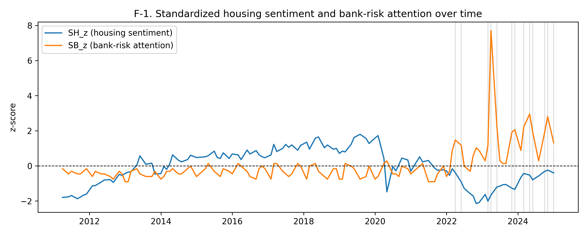
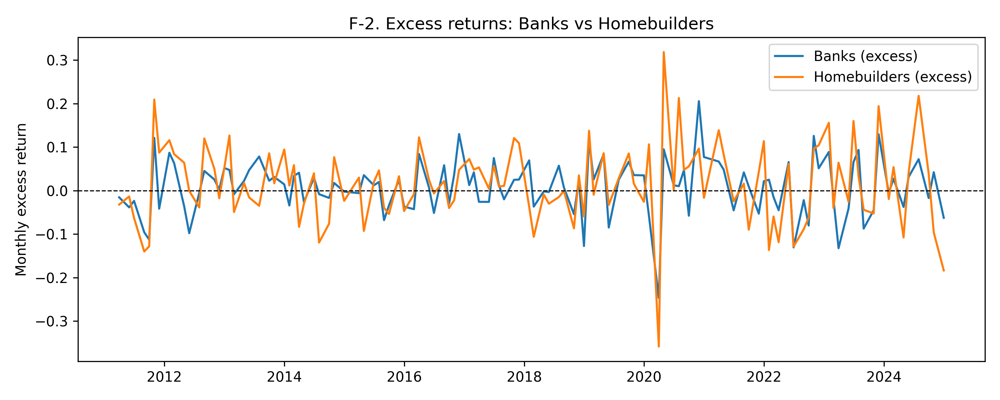
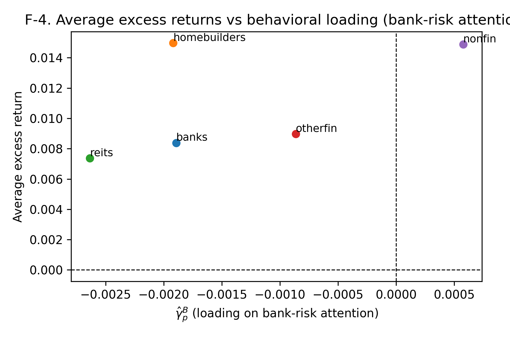
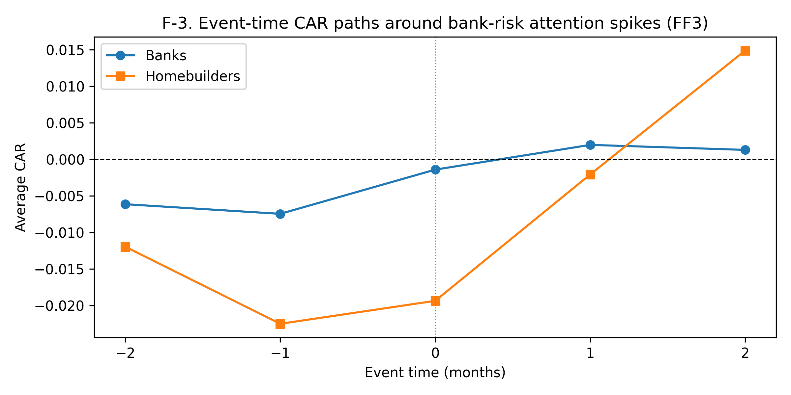

<!-- .slide: class="title-slide" -->
# Housing Sentiment and Bank Risk-Attention in Bank's Asset Pricing

Final Presentation | Riofrio Lara, Andres. | <em>Dec 8th, 2025</em>

</section>

---

## Research Questions &amp; Hypotheses

### Research questions

- Does housing-specific sentiment predict returns of housing-exposed portfolios after controlling for standard factors?
- Does bank-risk attention add incremental predictive or pricing content for banks relative to other housing-related sectors?
- Do attention “spikes” generate abnormal returns for banks relative to homebuilders and REITs, and does this depend on housing sentiment?

--

### Hypotheses

- **H1 (housing sentiment predictability):** for housing-exposed portfolios $p$, $\gamma^H_p \neq 0$.
- **H2 (bank attention sector-specific):** $\gamma^B_{\text{banks}} \neq 0$ and $\gamma^B_{\text{non-banks}} \approx 0$.
- **H3 (priced exposures):** cross-sectional prices of risk $C_H \neq 0$ and $C_B \neq 0$.
- **H4 (event-time abnormal returns):** around attention spikes, $CAR_{\text{banks}} \neq CAR_{\text{homebuilders/REITs}}$.

---

## Motivation &amp; Contribution

- Behavioral variables (sentiment, attention) act as *state variables* that distort or complement standard risk factors.
- Banks are fragile and informationally opaque; housing-related equities are naturally exposed to beliefs about house prices and credit conditions.
- Uncertainty + dispersed beliefs:
  - Overreaction/underreaction to news, beliefs-dependent risk aversion.
  - Feedback between financial markets and the real economy.
  - Visual and textual news content that can trigger attention and trading.

--

## Contribution

- Embed housing sentiment $S^H_t$ and bank-risk attention $S^B_t$ in a standard linear factor-pricing framework.
- Use sector portfolios:
  - Banks, Homebuilders, REITs, Other Financials, Non-financials.
- Combine:
  - Time-series forecasting (predictability of returns),
  - Cross-sectional Fama–MacBeth pricing,
  - Event-study CARs around attention spikes.
- Ask: are effects bank-centric, or do they reflect sector rotation within the housing complex?

---

## Theoretical Model: Setup &amp; SDF

### Core objects

- Portfolios $p \in \mathcal{P}$; excess returns: $R^e_{p,t} = R_{p,t} - R_{f,t}$.
- Standard risk factors $F_t$ (e.g. $\text{MKT\_RF}$, $\text{SMB}$, $\text{HML}$).
- Behavioral state variables:
  - $S^H_t$: housing sentiment (slow-moving optimism/pessimism).
  - $S^B_t$: bank-risk attention (sharp, event-driven spikes).

--

### Stochastic discount factor with behavioral components

$$
m_{t+1} = a - b'F_t - c_H S^H_t - c_B S^B_t.
$$

- If $S^H_t$ or $S^B_t$ enters the SDF, exposures $\gamma^H_p, \gamma^B_p$ should be *priced* in the cross-section.
- **Mispricing channel:** high sentiment $\rightarrow$ overvaluation $\rightarrow$ lower future returns.
- **Risk channel:** sentiment/attention proxies for time-varying risk $\rightarrow$ higher required returns.

---

## Testable Equations &amp; Mapping to Hypotheses

### Predictive (time-series) equation

$$
R^e_{p,t+1} = \alpha_p + \beta_p' F_t + \gamma^H_p S^H_t + \gamma^B_p S^B_t + u_{p,t+1}.
$$

- $\gamma^H_p$: sensitivity to housing sentiment.  
- $\gamma^B_p$: sensitivity to bank-risk attention.

--

### Contemporaneous loadings (alphas &amp; fit)

$$
R^e_{p,t} = \alpha_p + \beta_p' F_t + \gamma^H_p S^H_t + \gamma^B_p S^B_t + \varepsilon_{p,t}.
$$

--

### Cross-sectional Fama–MacBeth

$$
\bar R_p = a + b' \hat\beta_p + c_H \hat\gamma^H_p + c_B \hat\gamma^B_p + \eta_p.
$$

- **H1–H2:** signs and magnitudes of $\gamma^H_p, \gamma^B_p$ in predictive equations.
- **H3:** non-zero $c_H, c_B$ in Fama–MacBeth cross-section.
- **H4:** event-time CARs built around spikes in $S^B_t$.

---

## Data &amp; Behavioral Measures

### Test assets (value-weighted portfolios)

- Banks  
- Homebuilders  
- REITs (broad real-estate proxy)  
- Other Financials  
- Non-financials  

--

### Risk factors &amp; macro controls

- FF3: $\text{MKT\_RF}$, $\text{SMB}$, $\text{HML}$.
- Spreads: $TERM_t = DGS10_t - TB3MS_t$, $DEF_t = BAA_t - AAA_t$.
- Other controls (robustness): UNRATE, INDPRO, 30Y mortgage rate.

--

### Behavioral variables

- Standardized housing sentiment:
  $$
  S^H_{z,t} = \frac{S^H_t - \mu(S^H)}{\sigma(S^H)}.
  $$
- Standardized bank-risk attention:
  $$
  S^B_{z,t} = \frac{S^B_t - \mu(S^B)}{\sigma(S^B)}.
  $$
- Attention spike indicators:
  $$\texttt{spike10}_t = \mathbf{1}\{S^B_{z,t} \ge p90\}$$
  $$\texttt{spike85}_t = \mathbf{1}\{S^B_{z,t} \ge p85\}$$

--

**Figures**

  

F-1. Standardized housing sentiment and bank-risk attention over time.

--

  

F-2. Excess returns: Banks vs Homebuilders.

---

## Empirical Strategy

### Timing &amp; information set

- All predictors $F_t, S^H_t, S^B_t$ are known at month $t$.
- Predictive regressions forecast $R^e_{p,t+1}$.
- Event study: event-time windows around months where $S^B_{z,t}$ is high.

--

### Three empirical blocks

1. **Time-series forecasting (H1–H2)**  
   - Estimate $\gamma^H_p, \gamma^B_p$ in  
     $$
     R^e_{p,t+1} = \alpha_p + \beta_p' F_t + \gamma^H_p S^H_{z,t} + \gamma^B_p S^B_{z,t} + u_{p,t+1}.
     $$
   - Newey–West standard errors (lag ≈ 6 months).

2. **Cross-sectional pricing (H3)**  
   - First pass: $\hat\beta_p, \hat\gamma^H_p, \hat\gamma^B_p$.  
   - Second pass: Fama–MacBeth prices $\lambda_{MKT}, C_H, C_B$.

--

3. **Event study (H4)**  
   - Events: $\texttt{spike10}$ / $\texttt{spike85}$ months.  
   - FF3 abnormal returns $AR_{p,t} = R_{p,t} - \hat{R}_{p,t}$.  
   - Cumulative abnormal returns:
     $$
     CAR_p[\tau_0,\tau_1] = \sum_{\tau=\tau_0}^{\tau_1} AR_{p,t+\tau}.
     $$
   - Compare Banks vs Homebuilders vs REITs, by housing-sentiment tercile.

---

## Key Results I: Predictive &amp; Cross-Sectional

### Predictive regressions

$$
R^e_{p,t+1} = \alpha_p + \beta_p' F_t + \gamma^H_p S^H_{z,t} + \gamma^B_p S^B_{z,t} + u_{p,t+1}.
$$

--

- **Housing sentiment $\gamma^H_p$:**
  - Homebuilders: negative $\gamma^H_p$, consistent with “high sentiment $\rightarrow$ lower future returns”, but $t \approx -1.3$.
  - REITs, Banks, Other Financials, Non-financials: $\gamma^H_p$ close to zero.
- **Bank-risk attention $\gamma^B_p$:**
  - Small across all sectors, including Banks.
  - No strong evidence of linear monthly predictability from bank-attention.
- Pre-2020: all behavioral slopes small and insignificant; post-2020: stronger negative loadings for Homebuilders but short sample.

--

### Cross-sectional Fama–MacBeth

- $\lambda_{MKT} > 0$, but imprecise (few test assets, monthly horizon).
- **Housing sentiment exposure:** $C_H \approx 0$ → not clearly priced.
- **Bank-attention exposure:** $C_B > 0$, borderline significant, larger in post-2020 subsample.
- Interpretation: some evidence that bearing bank-attention exposure is modestly rewarded, especially when bank fragility is salient.

--

  

F-4. Average excess returns vs loading on bank-risk attention $\hat\gamma^B_p$.

---

## Key Results II: Event Study &amp; Sector Rotation

### CARs around bank-attention spikes

- Events: months with high $S^B_{z,t}$ (top 10% or 15%).
- Windows: $[-1,+1]$, $[-2,+2]$, $[0,+3]$.
- Stratified by housing-sentiment terciles (high / mid / low).

--

### Main patterns

- **Banks:** CARs around spikes are modest and usually not statistically different from zero.
- **Homebuilders:** in low housing-sentiment terciles, large positive CARs (≈ 8–9% over $[-2,+2]$, strong $t$-stats).
- **REITs:** in low housing-sentiment terciles, negative CARs (≈ −4 to −5% over $[-2,+2]$, significant).
- Qualitative patterns robust when moving from spike10 to spike85 thresholds.

--

### Interpretation

- H4 (banks show dominant abnormal returns around attention spikes) is not supported.
- Instead, attention spikes + low housing sentiment look like **sector rotation**:
  - Investors tilt toward Homebuilders and away from REITs.
  - Banks play a more muted role in event-time abnormal performance.

  

F-3. Event-time CAR paths around bank-risk attention spikes (FF3).

--

## Results snapshot (H1–H4)

<table style="font-size:0.9em; width:100%; border-collapse:collapse;">
  <thead>
    <tr>
      <th style="text-align:left;">Block / Portfolio</th>
      <th style="text-align:center;">$\gamma^{H}_p$ (t)</th>
      <th style="text-align:center;">$\gamma^{B}_p$ (t)</th>
      <th style="text-align:center;">$CAR[-2,+2]$ at low $S^H$ (t)</th>
      <th style="text-align:center;">Cross-sec price(s)</th>
      <th style="text-align:left;">Takeaway</th>
    </tr>
  </thead>
  <tbody>
    <tr>
      <td style="text-align:left;">Banks</td>
      <td style="text-align:center;">0.0016 (0.27)</td>
      <td style="text-align:center;">0.0006 (0.13)</td>
      <td style="text-align:center;">-0.0037 (-0.54)</td>
      <td style="text-align:center;">&mdash;</td>
      <td style="text-align:left;">No strong housing- or attention-based predictability; muted CARs.</td>
    </tr>
    <tr>
      <td style="text-align:left;">Homebuilders</td>
      <td style="text-align:center;">-0.0123 (-1.34)</td>
      <td style="text-align:center;">-0.0053 (-0.73)</td>
      <td style="text-align:center;">0.0886 (3.22)</td>
      <td style="text-align:center;">&mdash;</td>
      <td style="text-align:left;">Sign-consistent $\gamma^{H}_p$ and large positive CARs in low sentiment.</td>
    </tr>
    <tr>
      <td style="text-align:left;">REITs</td>
      <td style="text-align:center;">-0.0009 (-0.17)</td>
      <td style="text-align:center;">0.0019 (0.52)</td>
      <td style="text-align:center;">-0.0469 (-3.67)</td>
      <td style="text-align:center;">&mdash;</td>
      <td style="text-align:left;">Weak slopes but strong negative CARs in low sentiment.</td>
    </tr>
    <tr>
      <td style="text-align:left;">Cross-section</td>
      <td style="text-align:center;">&mdash;</td>
      <td style="text-align:center;">&mdash;</td>
      <td style="text-align:center;">&mdash;</td>
      <td style="text-align:center;">$C_H = -0.3258\ (-0.38)$; $C_B = 1.8380\ (1.68)$</td>
      <td style="text-align:left;">$C_H$ not priced; $C_B$ positive and borderline significant.</td>
    </tr>
  </tbody>
</table>

---

## Conclusions

- **H1 (housing sentiment predictability):**  
  partial, weak support — negative loading for Homebuilders (especially post-2020), but imprecise and not robust across sectors.
- **H2 (bank attention special for banks):**  
  not supported — $\gamma^B_{\text{banks}}$ small; Non-financials do not show perfectly zero exposure either.
- **H3 (priced exposures):**  
  $C_H \approx 0$; $C_B > 0$ and borderline significant, stronger in post-2020 subsample.
- **H4 (bank CARs around spikes):**  
  not bank-centric — largest CARs are positive for Homebuilders and negative for REITs in low-sentiment states.