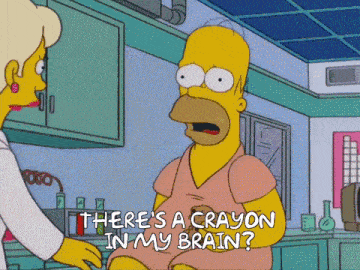
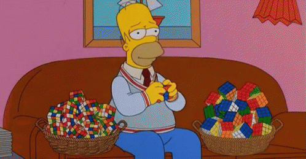
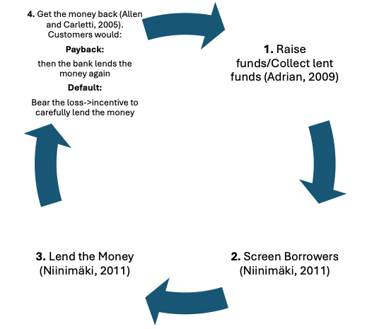
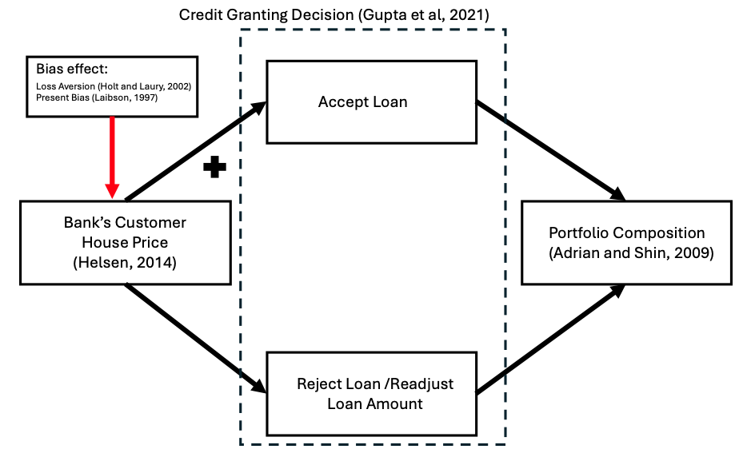
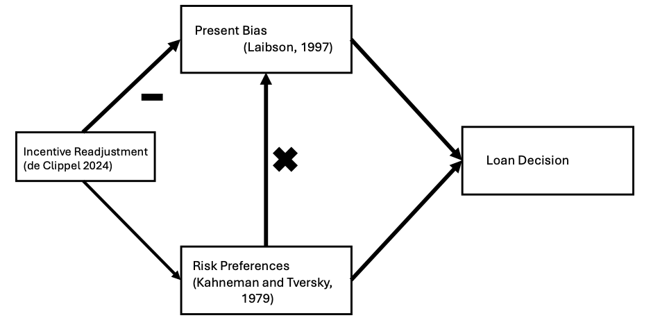
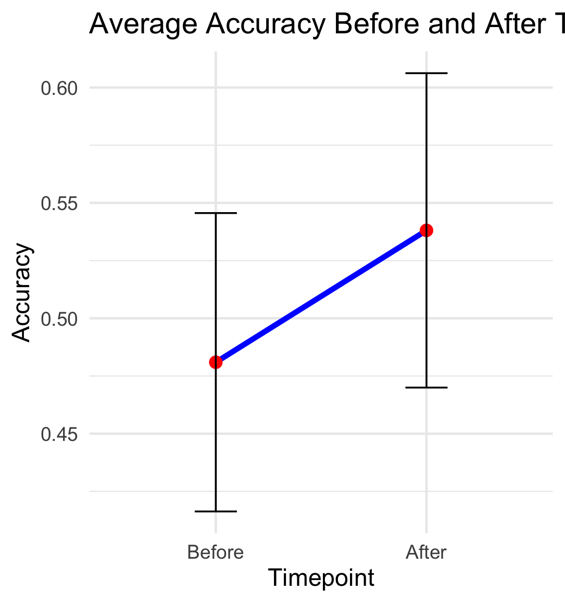
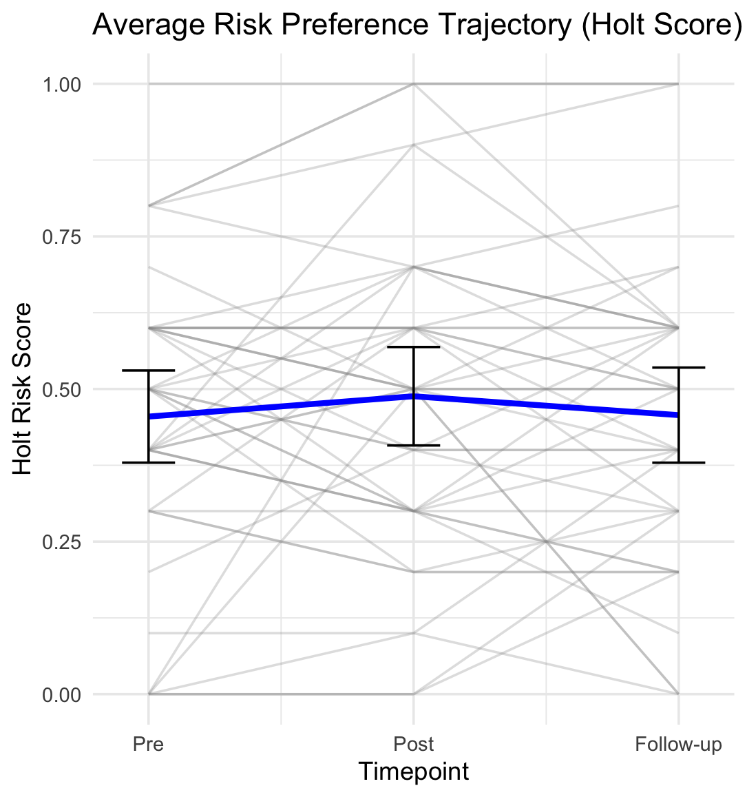

<!-- .slide: class="title-slide" -->
# The Effects of Present Bias and Loss Aversion over Loan Granting.
</section>

---
<!-- .slide: class="slide-heading" -->
## Research Questions

<section>
  

  

    

      <!-- Q3 -->
      

        
3

        <h3 class="rq-title">Can the deviation from rationality be reconciled?</h3>
        
If biases exist, could incentive readjustments restore alignment with optimal lending?

      

      <!-- Q2 -->
      

        
2

        <h3 class="rq-title">Are we observing a systematic bias?</h3>
        
Focus on <em>loss aversion</em> and <em>present bias</em> in loan-decision-making.

      

      <!-- Q1 -->
      

        
1

        <h3 class="rq-title">To what degree are loan officers rational decision makers?</h3>
        
Benchmark observed choices against normative, information-consistent decisions.

      

    

  

</section>

---
<!-- .slide: class="slide-heading clear-logo" -->
## What does this research do?

<section id="gif3cols">
  
  

    

      

        
      

      

        
      

      

        
      

    

  

</section>

---
<!-- .slide: class="slide-heading clear-logo" -->
## Optimal Decisions Start at the First Line

<section>
  <!-- Funnel → Forked Outcomes (no title) -->
  

    

      

        Can that deviation be reconciled?
      

      

        Biased decision makers influence the portfolio mix.
      

      

        Objective information input: hard &amp; soft information → loan decisions
      

      

    

    

      

        

          
Aligned incentives → prudent lending

          

        

      

      

        

          
Misaligned incentives → excessive lending

          
Credit risk materializes → bankruptcy

          

            <strong>≈30%</strong> unrecovered post-bankruptcy
          

          

        

      

    

  

</section>

---
<!-- .slide: class="slide-heading clear-logo" -->
## The "Rational" Banking process

  

---
<!-- .slide: class="slide-heading clear-logo" -->
## Heuristics in the Banking Process (1/2)

  

--
<!-- .slide: class="slide-heading clear-logo" -->
## Heuristics in the Banking Process (2/2)

  

---
<!-- .slide: class="slide-heading" -->
## The Behavioral Value of a Loan Decision

For loan \(i\), the value of action \(a\in\{\text{Approve},\text{Reject}\}\) folds <strong>three behavioral channels</strong> into one utility value:

\(\displaystyle U_{i,a,t}=\underbrace{w_{\gamma}(\hat p_i)}_{\text{weighting}}\;\underbrace{D(t_{a,R})}_{\text{timing}}\;\underbrace{v\!\big(x_{i,a,R,t}\big)}_{\text{value}}\;+\;\big[1-w_{\gamma}(\hat p_i)\big]\,D(t_{a,D})\,v\!\big(x_{i,a,D,t}\big)\)

  

    

      
\(w\)

      <h4>Probability weighting</h4>
      
\(w_{\gamma}(p)=\dfrac{p^{\gamma}}{[\,p^{\gamma}+(1-p)^{\gamma}\,]^{1/\gamma}}\), on the <em>perceived</em> repayment \(\hat p_i=m(\Omega_i)\). Collateral overweighting enters here.

    

    
×

    

      
\(D\)

      <h4>Present-biased timing</h4>
      
\(D(t)=\beta\delta^{t}\) with \(D(0)=1\). Present bias \(\beta\in(0,1]\), long-run patience \(\delta\in(0,1]\).

    

    
×

    

      
\(v\)

      <h4>Reference-dependent value</h4>
      
\(v(x)=x^{\alpha}\) for \(x\ge0\), else \(-\lambda(-x)^{\alpha}\); \(\alpha\in(0,1]\), \(\lambda\ge1\). Payoffs \(x=c-r_t\).

    

  

  
Evaluated within a satisficing consideration set \(S_t\subseteq A_t\) (De Clippel ancillary conditions).

---
<!-- .slide: class="slide-heading" -->
## From Value to Choice — and the Treatment Lever

The officer approves when approval dominates rejection; observed choice follows a logit:

\(\displaystyle \Pr(\text{Approve}_i)=\frac{\exp(\mu\,\Delta U_{i,t})}{1+\exp(\mu\,\Delta U_{i,t})},\qquad \Delta U_{i,t}=U_{i,\text{Approve},t}-U_{i,\text{Reject},t}\)

  
Approve iff \(\Delta U_{i,t}>0\) &nbsp;·&nbsp; \(\mu\) = choice consistency &nbsp;·&nbsp; <strong>Ranking task:</strong> order loans by \(\Delta U_{i,t}\) (rank-order logit)

  

    

      
\(D\)

      <h4>Timing</h4>
      
A delayed bonus discounts the immediate gain: \(D(t)=\beta\delta^{t}\).

    

    

      
\(\kappa\)

      <h4>Loss exposure</h4>
      
Penalty \(\kappa_t>0\) turns a bad approval into a reference-point loss, \(x_{i,\text{Approve},D,t}=B_i-\kappa_t L_i-r_t<0\), activating \(v(x)=-\lambda(-x)^{\alpha}\).

    

  

  
→ deactivates present bias, with no change to true risk

---
<!-- .slide: class="slide-heading" -->
## Experimental Design

<section data-background-color="transparent">
  

  

    

      
Experiments:

      

        <!-- Step 1 highlights LAB, Step 2 highlights FIELD -->
        
Lab Experiment

        
Field Experiment

      

    

  

</section>

--
<!-- .slide: class="slide-heading" -->
## Experimental Design

  

    
Lab Experiment

    
Field Experiment

  

<table style="border-collapse:collapse; margin:auto;">
  <thead>
    <tr>
      <th style="border:1px solid #ccc; padding:6px;"></th>
      <th colspan="2" style="border:1px solid #ccc; padding:6px; text-align:center;">Time Delay</th>
    </tr>
    <tr>
      <th style="border:1px solid #ccc; padding:6px; text-align:left;">Incentive Adjustment</th>
      <th style="border:1px solid #ccc; padding:6px; text-align:center;">Yes</th>
      <th style="border:1px solid #ccc; padding:6px; text-align:center;">No</th>
    </tr>
  </thead>
  <tbody>
    <tr>
      <td style="border:1px solid #ccc; padding:6px;"><strong>Yes</strong></td>
      <td style="border:1px solid #ccc; padding:6px; text-align:center;">Time Delay | Incentive Adjustment</td>
      <td style="border:1px solid #ccc; padding:6px; text-align:center;">No Time Delay | Incentive Adjustment</td>
    </tr>
    <tr>
      <td style="border:1px solid #ccc; padding:6px;"><strong>No</strong></td>
      <td style="border:1px solid #ccc; padding:6px; text-align:center;">No Time Delay | Incentive Adjustment</td>
      <td style="border:1px solid #ccc; padding:6px; text-align:center;">No Time Delay | No Incentive Adjustment</td>
    </tr>
  </tbody>
</table>

--
<!-- .slide: class="slide-heading" -->
## Experimental Design

  

    
Lab Experiment

    
Field Experiment

  

  <table style="border-collapse:collapse; margin:auto;">
    <thead>
      <tr>
        <th style="border:1px solid #ccc; padding:6px;">Subject Measure</th>
        <th style="border:1px solid #ccc; padding:6px;">Source</th>
      </tr>
    </thead>
    <tbody>
      <tr><td style="border:1px solid #ccc; padding:6px;">Risk Aversion</td>
          <td style="border:1px solid #ccc; padding:6px;">Holt and Laury, 2002</td></tr>
      <tr><td style="border:1px solid #ccc; padding:6px;">Short-term Impatience</td>
          <td style="border:1px solid #ccc; padding:6px;">Andreoni, 2012</td></tr>
      <tr><td style="border:1px solid #ccc; padding:6px;">Risk Seekingness</td>
          <td style="border:1px solid #ccc; padding:6px;">Eckel and Grossman, 2002</td></tr>
      <tr><td style="border:1px solid #ccc; padding:6px;">DOSPERT - Risk Taking</td>
          <td style="border:1px solid #ccc; padding:6px;">Blais and Weber, 2006</td></tr>
    </tbody>
  </table>

--
<!-- .slide: class="slide-heading" -->
## Experimental Design - A Decision Making Situation

  

    
Lab Experiment

    
Field Experiment

  

- Loan Officer Training in 5 minutes
- Decision making - rank from most to least chances of repayment (5 decisions)

<section>

  

    
CREDIT APPLICATION A

    

      <table>
        <tr><td>Amount Requested</td><td><strong>$10,000.00</strong></td></tr>
        <tr><td>Term</td><td>36 periods</td></tr>
        <tr><td>Payment Frequency</td><td>Monthly X</td></tr>
        <tr><td>Installment (payment)</td><td><strong>$346.65</strong></td></tr>
        <tr><td>Purpose of Credit</td><td>Consumer</td></tr>
        <tr><td>Type of Collateral</td><td>Mortgage-backed</td></tr>
        <tr><td>Source of Income</td><td>Private employee (5 years)</td></tr>
        <tr><td>Score</td><td>AAA (950; positive bureau history – 10 years)</td></tr>
        <tr><td>Total Consolidated Risk</td><td><strong>$10,000.00</strong></td></tr>
      </table>
    

  

  

    
Payment Capacity Analysis

    

      <table style="border-spacing:0 6px;">
        <thead>
          <tr>
            <th>Assets</th><th style="text-align:right;">Value</th>
            <th></th>
            <th>Liabilities</th><th style="text-align:right;">Value</th>
          </tr>
        </thead>
        <tbody>
          <tr><td>Real Estate</td><td style="text-align:right;">$20,000.00</td><td></td><td>Secured Bank Debt</td><td style="text-align:right;">$19,120.89</td></tr>
          <tr><td>Other Assets</td><td style="text-align:right;">$10,000.00</td><td></td><td>Short-Term Liabilities</td><td style="text-align:right;">$953.75</td></tr>
        </tbody>
        <thead>
          <tr>
            <th>Income / Expense</th><th style="text-align:right;">Amount</th>
            <th></th>
            <th>Income / Expense</th><th style="text-align:right;">Amount</th>
          </tr>
        </thead>
        <tbody>
          <tr><td>Income</td><td style="text-align:right;">$1,247.55</td><td></td><td>Financial Expenses</td><td style="text-align:right;">$459.80</td></tr>
          <tr><td>Family Expenses</td><td style="text-align:right;">$98.00</td><td></td><td>Net Savings</td><td style="text-align:right;"><strong>$689.75</strong></td></tr>
          <tr><td style="color:#5b6573;">Total Expenses</td><td style="text-align:right;">$557.80</td><td></td><td></td><td></td></tr>
        </tbody>
      </table>
    

  

</section>

--
<!-- .slide: class="slide-heading" -->
## Experimental Design

  

    
Lab Experiment

    
Field Experiment

  

--

<!-- .slide: class="slide-heading" -->
## Experimental Design

  

    
Lab Experiment

    
Field Experiment

  

  <ul class="vsteps">
    <li>1Loan Officers undergo a "regular" workshop.</li>
    <li>2Fill surveys (behavioral traits).</li>
    <li>3They have to make decision sets</li>
    <li>4Start an unrelated training.</li>
    <li>5HR provides Stimuli</li>
    <li>6They have to make decisions sets</li>
  </ul>

---
<!-- .slide: class="slide-heading" -->
## Preliminary Results

<!-- .slide: class="slide-heading" -->
<h2>Design & Sample Summary</h2>

  

    Study Setup
  

  

    <table style="width:100%; border-collapse:separate; border-spacing:0; font-size:1.02em;">
      <tbody>
        <tr>
          <th style="width:32%; text-align:left; padding:10px 14px; color:#5b6573; border-bottom:1px solid #e6eaef;">Participants (n)</th>
          <td style="padding:10px 14px; border-bottom:1px solid #e6eaef;"><strong>42 loan officers</strong></td>
        </tr>
        <tr style="background:#ffffff;">
          <th style="text-align:left; padding:10px 14px; color:#5b6573; border-bottom:1px solid #e6eaef;">Age range</th>
          <td style="padding:10px 14px; border-bottom:1px solid #e6eaef;">25–45 years</td>
        </tr>
        <tr>
          <th style="text-align:left; padding:10px 14px; color:#5b6573; border-bottom:1px solid #e6eaef;">Gender</th>
          <td style="padding:10px 14px; border-bottom:1px solid #e6eaef;">17 male, 25 female</td>
        </tr>
        <tr style="background:#ffffff;">
          <th style="text-align:left; padding:10px 14px; color:#5b6573; border-bottom:1px solid #e6eaef;">Experience (role)</th>
          <td style="padding:10px 14px; border-bottom:1px solid #e6eaef;">2 months – 10 years</td>
        </tr>
        <tr>
          <th style="text-align:left; padding:10px 14px; color:#5b6573; border-bottom:1px solid #e6eaef;">Context</th>
          <td style="padding:10px 14px; border-bottom:1px solid #e6eaef;">During a scheduled training</td>
        </tr>
        <tr style="background:#ffffff;">
          <th style="text-align:left; padding:10px 14px; color:#5b6573; border-bottom:1px solid #e6eaef;">Instruments</th>
          <td style="padding:10px 14px; border-bottom:1px solid #e6eaef;">DOSPERT test; Holt–Laury risk test</td>
        </tr>
        <tr>
          <th style="text-align:left; padding:10px 14px; color:#5b6573; border-bottom:1px solid #e6eaef;">Decision sets</th>
          <td style="padding:10px 14px; border-bottom:1px solid #e6eaef;">Based on current bank standards, pre &amp; post stimuli</td>
        </tr>
        <tr style="background:#ffffff;">
          <th style="text-align:left; padding:10px 14px; color:#5b6573;">Stimulus</th>
          <td style="padding:10px 14px;">HR announced a change to bonus calculation (vs. status quo)</td>
        </tr>
      </tbody>
    </table>
  

--

  

    Results & Interpretation
  

  

    <table style="width:100%; border-collapse:separate; border-spacing:0; font-size:1.02em;">
      <tbody>
        <tr>
          <th style="width:36%; text-align:left; padding:10px 14px; color:#5b6573; border-bottom:1px solid #e6eaef;">Loan decision accuracy</th>
          <td style="padding:10px 14px; border-bottom:1px solid #e6eaef;">
            <strong>↑ 46% → 53%</strong> when present bias was deactivated
          </td>
        </tr>
        <tr style="background:#ffffff;">
          <th style="text-align:left; padding:10px 14px; color:#5b6573; border-bottom:1px solid #e6eaef;">Collective risk preferences</th>
          <td style="padding:10px 14px; border-bottom:1px solid #e6eaef;">
            Shifted in the very short term, then converged back toward baseline
          </td>
        </tr>
        <tr>
          <th style="text-align:left; padding:10px 14px; color:#5b6573;">Statistical power</th>
          <td style="padding:10px 14px;">
            Study underpowered; ~<strong>290</strong> participants estimated for statistical significance
          </td>
        </tr>
      </tbody>
    </table>
  

--
<!-- .slide: class="slide-heading diagram closer" -->
# Better Decision Makers

  

--
<!-- .slide: class="slide-heading diagram closer" -->
## Less willing to take risks (for a bit)

  

---
<!-- .slide: class="slide-heading" -->
## What the Simulations Show

  

    
Simulated profiles map onto the four treatments<small>one calibrated agent per profile · 100 choices each · 10,000 simulations</small>

    <table>
      <thead>
        <tr>
          <th>Condition</th>
          <th>Behavioral profile</th>
          <th class="num">Present bias \(\beta\)</th>
          <th class="num">Loss aversion \(\lambda\)</th>
          <th class="num">Risk-taking</th>
        </tr>
      </thead>
      <tbody>
        <tr>
          <td class="cell">Control</td>
          <td>Risk-averse, present-biased</td>
          <td class="num pb">0.30</td><td class="num">0.01</td><td class="num">54%</td>
        </tr>
        <tr>
          <td class="cell">Delay only</td>
          <td>Risk-averse, patient</td>
          <td class="num pat">0.70</td><td class="num">0.01</td><td class="num">54%</td>
        </tr>
        <tr>
          <td class="cell">Incentive only</td>
          <td>Risk-seeking, present-biased</td>
          <td class="num pb">0.10</td><td class="num">2.0</td><td class="num">59%</td>
        </tr>
        <tr class="target">
          <td class="cell">Delay + incentive</td>
          <td>Risk-averse, patient, loss-averse</td>
          <td class="num pat">0.80</td><td class="num">2.0</td><td class="num">58%</td>
        </tr>
      </tbody>
    </table>
  

  
Risk-taking = share choosing the risky option across 100 simulated choices. Each treatment toggles present bias (via \(\beta\), the delay channel) and loss aversion (via \(\lambda\), the incentive channel); \(\alpha\) and \(\delta\) are held in the background.

---
<!-- .slide: class="slide-heading" -->

## Thank you. 

