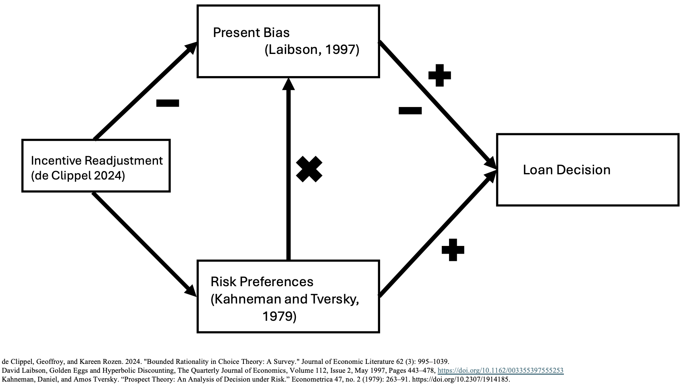

<!-- .slide: class="title-slide" -->
# Present Bias and Loss Aversion Effects over Loan Granting
</section>

---
<!-- .slide: class="slide-heading" -->
## Research Questions

<section>
  

  

    

      <!-- Q3 -->
      

        
3

        <h3 class="rq-title">Can the deviation from rationality be reconciled?</h3>
        
If biases exist, could incentive readjustments restore alignment with optimal lending?

      

      <!-- Q2 -->
      

        
2

        <h3 class="rq-title">Are we observing a systematic bias?</h3>
        
Focus on <em>loss aversion</em> and <em>present bias</em> in loan-decision-making.

      

      <!-- Q1 -->
      

        
1

        <h3 class="rq-title">To what degree are loan officers rational decision makers?</h3>
        
Benchmark observed choices against normative, information-consistent decisions.

      

    

  

</section>

---
<!-- .slide: class="slide-heading closer" -->
## What does this research do?

<section id="gif3cols">
  
  

    

      

        
      

      

        
      

      

        
      

    

  

</section>

---
<!-- .slide: class="slide-heading closer" -->
## Optimal Decisions Start at the First Line

<section>
  <!-- Funnel → Forked Outcomes (no title) -->
  

    

      

        Can that deviation be reconciled?
      

      

        Biased decision makers influence the portfolio mix.
      

      

        Objective information input: hard &amp; soft information → loan decisions
      

      

    

    

      

        

          
Aligned incentives → prudent lending

          

        

      

      

        

          
Misaligned incentives → excessive lending

          
Credit risk materializes → bankruptcy

          

            <strong>≈30%</strong> unrecovered post-bankruptcy
          

          

        

      

    

  

</section>

---
<!-- .slide: class="slide-heading closer" -->
## ~70% of your Banking Statement is being lent

  

    

      

Deposits

      

        
$5,400

        
median bank account balance

      

    

    

      <svg xmlns="http://www.w3.org/2000/svg" viewBox="0 0 820 240" preserveAspectRatio="xMidYMid meet" aria-hidden="true">
        <g>
          <path class="ribbon loans" d="M160 70 C280 70 540 40 660 40 L660 100 C540 100 280 120 160 120 Z"/>
          <path class="ribbon other" d="M160 140 C280 140 540 160 660 160 L660 200 C540 200 280 190 160 190 Z"/>
          <rect class="stub" x="140" y="70" width="20" height="120"/>
          <rect class="dock loans" x="660" y="40" width="20" height="60"/>
          <rect class="dock other" x="660" y="160" width="20" height="40"/>
        </g>
      </svg>
    

    

      

        

Loans

71%

      

      

        

Other uses

29%

      

      
Federal Reserve

    

    
Sources: Yahoo Finance · Federal Reserve

  

---
<!-- .slide: class="slide-heading closer" -->
## The "Rational" Banking process

  

---
<!-- .slide: class="slide-heading diagram closer" -->
## Heuristics in the Banking Process (1/2)

  

--
<!-- .slide: class="slide-heading diagram closer" -->
## Heuristics in the Banking Process (2/2)

  

---
<!-- .slide: class="slide-heading closer" -->
## The Utility Function

\begin{aligned}
U_t \;=\;
\underbrace{\mathbb{E}_t^{\,w}\!\big[v(c_t\mid r_t)\big]}_{\text{within-period (decision-weighted)}}
\;+\;
\underbrace{\beta \sum_{\tau=t+1}^{T}\delta^{\,\tau-t}\,
\mathbb{E}\!\Big[\mathbb{E}_\tau^{\,w}\!\big[v(c_\tau\mid r_\tau)\big]\Big]}_{\text{discounted continuation value}}
\end{aligned}

--

  <table style="border-collapse:collapse; margin:auto;">
    <thead>
      <tr>
        <th style="border:1px solid #ccc; padding:6px;">Symbol</th>
        <th style="border:1px solid #ccc; padding:6px;">Meaning</th>
      </tr>
    </thead>
    <tbody>
      <tr><td style="border:1px solid #ccc; padding:6px;">$U_t$</td>
          <td style="border:1px solid #ccc; padding:6px;">Intertemporal utility at time $t$ (PT within-period via $v$, quasi-hyperbolic across time)</td></tr>
      <tr><td style="border:1px solid #ccc; padding:6px;">$v(c\mid r)$</td>
          <td style="border:1px solid #ccc; padding:6px;">Within-period Prospect Theory value around reference $r$: $(c-r)_{+}^{\alpha_v}-\lambda\,(r-c)_{+}^{\beta_v}$</td></tr>
      <tr><td style="border:1px solid #ccc; padding:6px;">$\mathbb{E}_t^{\,w}[\cdot]$</td>
          <td style="border:1px solid #ccc; padding:6px;">Decision-weighted expectation at $t$ (rank-dependent); puts weight $w(p_t)$ on repay and $1-w(p_t)$ on default</td></tr>
      <tr><td style="border:1px solid #ccc; padding:6px;">$\mathbb{E}[\cdot]$</td>
          <td style="border:1px solid #ccc; padding:6px;">(Regular) expectation over future uncertainty conditional on information at $t$</td></tr>
      <tr><td style="border:1px solid #ccc; padding:6px;">$c_t^{\mathrm{repay}},\; c_t^{\mathrm{default}}$</td>
          <td style="border:1px solid #ccc; padding:6px;">Outcomes (payoffs) in repay vs. default state at time $t$</td></tr>
      <tr><td style="border:1px solid #ccc; padding:6px;">$r_t$</td>
          <td style="border:1px solid #ccc; padding:6px;">Reference point at time $t$</td></tr>
      <tr><td style="border:1px solid #ccc; padding:6px;">$p_t$</td>
          <td style="border:1px solid #ccc; padding:6px;">Objective probability of “repay” at time $t$ (Bernoulli prospect)</td></tr>
      <tr><td style="border:1px solid #ccc; padding:6px;">$w(\cdot)$</td>
          <td style="border:1px solid #ccc; padding:6px;">Probability-weighting function, $w\!:\![0,1]\to[0,1]$</td></tr>
      <tr><td style="border:1px solid #ccc; padding:6px;">$(x)_{+}$</td>
          <td style="border:1px solid #ccc; padding:6px;">Positive part: $(x)_{+}=\max\{x,0\}$</td></tr>
      <tr><td style="border:1px solid #ccc; padding:6px;">$\alpha_v,\;\beta_v$</td>
          <td style="border:1px solid #ccc; padding:6px;">Value curvature in gains ($\alpha_v$) and losses ($\beta_v$), typically $\in(0,1]$</td></tr>
      <tr><td style="border:1px solid #ccc; padding:6px;">$\lambda$</td>
          <td style="border:1px solid #ccc; padding:6px;">Loss aversion ($\lambda\ge 1$)</td></tr>
      <tr><td style="border:1px solid #ccc; padding:6px;">$\beta\in(0,1]$</td>
          <td style="border:1px solid #ccc; padding:6px;">Present-bias factor (quasi-hyperbolic)</td></tr>
      <tr><td style="border:1px solid #ccc; padding:6px;">$\delta\in(0,1)$</td>
          <td style="border:1px solid #ccc; padding:6px;">Per-period exponential discount factor</td></tr>
      <tr><td style="border:1px solid #ccc; padding:6px;">$T$</td>
          <td style="border:1px solid #ccc; padding:6px;">Time horizon (finite in the displayed sum)</

--

<!-- .slide: class="slide-heading" -->
## The Decision Rule Our Decision Maker Follows

Utility for each scenario is computed via Khaneman Tversky value $v(\cdot\mid r)$ for the corresponding outcomes.

**Decision-weighted expected utilities:**

$$\mathbb{E}\left[U\mid \text{Accept}\right] = w(p)U_1 + \bigl[1-w(p)\bigr]U_2$$

$$\mathbb{E}\left[U\mid \text{Reject}\right] = w(p)U_3 + \bigl[1-w(p)\bigr]U_4$$

<section>
  

  

    <table>
      <thead>
        <tr>
          <th class="stub"></th>
          <th><strong>Right</strong></th>
          <th><strong>Wrong</strong></th>
        </tr>
      </thead>
      <tbody>
        <tr>
          <th class="stub">Accept</th>
          <td class="right">
            \(U_1\)
            <small>Accept a good loan (repay)</small>
          </td>
          <td class="wrong">
            \(U_2\)
            <small>Type II — accept a bad loan (default)</small>
          </td>
        </tr>
        <tr>
          <th class="stub">Reject</th>
          <td class="right">
            \(U_4\)
            <small>Reject a bad loan (default)</small>
          </td>
          <td class="wrong">
            \(U_3\)
            <small>Type I — reject a good loan (repay)</small>
          </td>
        </tr>
      </tbody>
    </table>
  

</section>

In a multi-scenario task, rank by the expected value above (largest to smallest).

--

<!-- .slide: class="slide-heading" -->
## Intertemporal Choice Component (Laibson, 1997)

$$
U_t = V_t + \beta \sum_{\tau = t+1}^{T} \delta^{\,\tau - t}\, \mathbb{E}\!\left[V_\tau\right]
$$

Where,

- $V_t$ : KKhaneman Tversky decision-weighted within-period value (relative to $r_t$)  
- $\beta$ : present-bias parameter $\beta \in(0,1]$  
- $\delta$ : discount factor $\delta\in(0,1)$  
- $T$ : the time horizon

--

<!-- .slide: class="slide-heading" -->
## Reference Formation (Kőszegi & Rabin, 2006)

We adopt expectations-based **reference formation** for $r_t$ (e.g., $r_t=\mathbb{E}_{t-1}[c_t]$ or partial adaptation).
Within-period value follows Kahneman Tversky (1979) Prospect Theory (see “The Utility Function”).

--

<!-- .slide: class="slide-heading" -->
## Prospect Theory Value Around the Reference (Kahneman–Tversky, 1979)

$$
v(c_t\mid r_t)=
\begin{cases}
  (c_t-r_t)^{\alpha_v}, & c_t\ge r_t, \\\\[4pt]
  -\lambda\,(r_t-c_t)^{\beta_v}, & c_t< r_t
\end{cases}
\qquad \alpha_v,\beta_v\in(0,1],\ \lambda\ge 1
$$

Decision weighting for a Bernoulli prospect (repay vs default):
$$
V_t = w(p_t)v\big(c_t^{\text{repay}}\mid r_t\big)
      + \bigl[1-w(p_t)\bigr]v\big(c_t^{\text{default}}\mid r_t\big)
$$

--

<!-- .slide: class="slide-heading" -->
## Hybrid Model (Present Bias + Prospect Theory + Attention)

$$U_t= V_t + \beta \sum_{\tau=t+1}^{T} \delta^{\tau-t}\,\mathbb{E}\left[V_\tau\right]$$

$$V_t = w(p_t)v(c_t^{\text{repay}}\mid r_t)+\bigl[1-w(p_t)\bigr]v(c_t^{\text{default}}\mid r_t)$$

--

<!-- .slide: class="slide-heading" -->
## To be Consistent with De Clippel Ancillary Conditions

- $A_t$: available menu  
- $F(A_t)$: feasible attention sets  
- $S_t \subseteq A_t$: endogenous consideration set  

**Feasible utility path:**

\begin{aligned}
\tilde U_t
&= \max_{c_t\in S_t}\left\{
  V_t(c_t\mid r_t)
  {}+ \beta \sum_{\tau=t+1}^{T}\delta^{\tau-t}\,
     \mathbb{E}_{S_\tau}\!\bigl[\,V_\tau(c_\tau\mid r_\tau)\,\bigr]
\right\}
\\[4pt]
&\text{s.t.}\quad
  S_t\in F(A_t),\qquad
  V_t(c_t\mid r_t)\ge \theta_t
\end{aligned}

--
<!-- .slide: class="slide-heading" -->
## The Complete Utility Function

\begin{aligned}
U_t
&=
\underbrace{
  \underbrace{w(p_t)\big[(c_t^{\mathrm{repay}}-r_t)_{+}^{\alpha_v}\big]}_{\text{repay branch}}
  - \lambda\,(r_t-c_t^{\mathrm{repay}})_{+}^{\beta_v}
  + \underbrace{\bigl(1-w(p_t)\bigr)\big[(c_t^{\mathrm{default}}-r_t)_{+}^{\alpha_v}\big]}_{\text{default branch}}
  - \lambda\,(r_t-c_t^{\mathrm{default}})_{+}^{\beta_v}
}_{\substack{\text{within-period Prospect Theory value}\\ V_t(c_t\mid r_t)}}
\\[6pt]
&\quad+\;
\underbrace{
  \beta \sum_{\tau=t+1}^{T} \delta^{\tau-t}\,\mathbb{E}\!\left[
    w(p_\tau)\big[(c_\tau^{\mathrm{repay}}-r_\tau)_{+}^{\alpha_v}\big]
    - \lambda\,(r_\tau-c_\tau^{\mathrm{repay}})_{+}^{\beta_v}
    + \bigl(1-w(p_\tau)\bigr)\big[(c_\tau^{\mathrm{default}}-r_\tau)_{+}^{\alpha_v}\big]
    - \lambda\,(r_\tau-c_\tau^{\mathrm{default}})_{+}^{\beta_v}
  \right]
}_{\mathclap{\text{discounted expectation}}}
\end{aligned}

---
<!-- .slide: class="slide-heading closer" -->
## A Blur in the Perceived Feasibility Frontier

  
  

--
<!-- .slide: class="slide-heading" -->
## The effect of an Ancillary condition "d" (Clippel, Nd)

- $\Psi$ : bias (present bias)
- $\lambda$ : risk preference
- Decision set:

$$L=C(\{ x,y \}, \Psi, \lambda) \textnormal{ where, } (x,y)\in \mathbb{R}^2_+ $$

And the frontier:

$$y=\left(1-\left(\frac{x}{\psi}\right)^{1-\lambda}\right)^{1-\lambda}$$

--
<!-- .slide: class="slide-heading" -->
## The Frontier perception shift and inter-temporal effect

- Distorded decision set:
$$\psi_t=\psi(\psi_{t-1},A_t)$$
- Inter-temporal effect of time dependency:
$$\text{where, } x\in [0,\psi_t] \text{ and, } \lambda \in (0,1)$$

---
<!-- .slide: class="slide-heading" -->
## Experimental Design

<section data-background-color="transparent">
  

  

    

      
Experiments:

      

        <!-- Step 1 highlights LAB, Step 2 highlights FIELD -->
        
Lab Experiment

        
Field Experiment

      

    

  

</section>

--
<!-- .slide: class="slide-heading" -->
## Experimental Design

  

    
Lab Experiment

    
Field Experiment

  

<table style="border-collapse:collapse; margin:auto;">
  <thead>
    <tr>
      <th style="border:1px solid #ccc; padding:6px;"></th>
      <th colspan="2" style="border:1px solid #ccc; padding:6px; text-align:center;">Time Delay</th>
    </tr>
    <tr>
      <th style="border:1px solid #ccc; padding:6px; text-align:left;">Incentive Adjustment</th>
      <th style="border:1px solid #ccc; padding:6px; text-align:center;">Yes</th>
      <th style="border:1px solid #ccc; padding:6px; text-align:center;">No</th>
    </tr>
  </thead>
  <tbody>
    <tr>
      <td style="border:1px solid #ccc; padding:6px;"><strong>Yes</strong></td>
      <td style="border:1px solid #ccc; padding:6px; text-align:center;">Time Delay | Incentive Adjustment</td>
      <td style="border:1px solid #ccc; padding:6px; text-align:center;">No Time Delay | Incentive Adjustment</td>
    </tr>
    <tr>
      <td style="border:1px solid #ccc; padding:6px;"><strong>No</strong></td>
      <td style="border:1px solid #ccc; padding:6px; text-align:center;">No Time Delay | Incentive Adjustment</td>
      <td style="border:1px solid #ccc; padding:6px; text-align:center;">No Time Delay | No Incentive Adjustment</td>
    </tr>
  </tbody>
</table>

--
<!-- .slide: class="slide-heading" -->
## Experimental Design

  

    
Lab Experiment

    
Field Experiment

  

  <table style="border-collapse:collapse; margin:auto;">
    <thead>
      <tr>
        <th style="border:1px solid #ccc; padding:6px;">Subject Measure</th>
        <th style="border:1px solid #ccc; padding:6px;">Source</th>
      </tr>
    </thead>
    <tbody>
      <tr><td style="border:1px solid #ccc; padding:6px;">Risk Aversion</td>
          <td style="border:1px solid #ccc; padding:6px;">Holt and Laury, 2002</td></tr>
      <tr><td style="border:1px solid #ccc; padding:6px;">Short-term Impatience</td>
          <td style="border:1px solid #ccc; padding:6px;">Andreoni, 2012</td></tr>
      <tr><td style="border:1px solid #ccc; padding:6px;">Risk Seekingness</td>
          <td style="border:1px solid #ccc; padding:6px;">Eckel and Grossman, 2002</td></tr>
      <tr><td style="border:1px solid #ccc; padding:6px;">DOSPERT - Risk Taking</td>
          <td style="border:1px solid #ccc; padding:6px;">Blais and Weber, 2006</td></tr>
    </tbody>
  </table>

--
<!-- .slide: class="slide-heading" -->
## Experimental Design - A Decision Making Situation

  

    
Lab Experiment

    
Field Experiment

  

- Loan Officer Training in 5 minutes
- Decision making - rank from most to least chances of repayment (5 decisions)

<section>

  

    
CREDIT APPLICATION A

    

      <table>
        <tr><td>Amount Requested</td><td><strong>$10,000.00</strong></td></tr>
        <tr><td>Term</td><td>36 periods</td></tr>
        <tr><td>Payment Frequency</td><td>Monthly X</td></tr>
        <tr><td>Installment (payment)</td><td><strong>$346.65</strong></td></tr>
        <tr><td>Purpose of Credit</td><td>Consumer</td></tr>
        <tr><td>Type of Collateral</td><td>Mortgage-backed</td></tr>
        <tr><td>Source of Income</td><td>Private employee (5 years)</td></tr>
        <tr><td>Score</td><td>AAA (950; positive bureau history – 10 years)</td></tr>
        <tr><td>Total Consolidated Risk</td><td><strong>$10,000.00</strong></td></tr>
      </table>
    

  

  

    
Payment Capacity Analysis

    

      <table style="border-spacing:0 6px;">
        <thead>
          <tr>
            <th>Assets</th><th style="text-align:right;">Value</th>
            <th></th>
            <th>Liabilities</th><th style="text-align:right;">Value</th>
          </tr>
        </thead>
        <tbody>
          <tr><td>Real Estate</td><td style="text-align:right;">$20,000.00</td><td></td><td>Secured Bank Debt</td><td style="text-align:right;">$19,120.89</td></tr>
          <tr><td>Other Assets</td><td style="text-align:right;">$10,000.00</td><td></td><td>Short-Term Liabilities</td><td style="text-align:right;">$953.75</td></tr>
        </tbody>
        <thead>
          <tr>
            <th>Income / Expense</th><th style="text-align:right;">Amount</th>
            <th></th>
            <th>Income / Expense</th><th style="text-align:right;">Amount</th>
          </tr>
        </thead>
        <tbody>
          <tr><td>Income</td><td style="text-align:right;">$1,247.55</td><td></td><td>Financial Expenses</td><td style="text-align:right;">$459.80</td></tr>
          <tr><td>Family Expenses</td><td style="text-align:right;">$98.00</td><td></td><td>Net Savings</td><td style="text-align:right;"><strong>$689.75</strong></td></tr>
          <tr><td style="color:#5b6573;">Total Expenses</td><td style="text-align:right;">$557.80</td><td></td><td></td><td></td></tr>
        </tbody>
      </table>
    

  

</section>

--
<!-- .slide: class="slide-heading" -->
## Experimental Design

  

    
Lab Experiment

    
Field Experiment

  

  <ul class="vsteps">
    <li>1Loan Officers undergo a "regular" workshop.</li>
    <li>2Fill surveys (behavioral traits).</li>
    <li>3They have to make decision sets</li>
    <li>4Start an unrelated training.</li>
    <li>5HR provides Stimuli</li>
    <li>6They have to make decisions sets</li>
  </ul>

---
<!-- .slide: class="slide-heading" -->
## Preliminary Results

<!-- .slide: class="slide-heading" -->
<h2>Design & Sample Summary</h2>

  

    Study Setup
  

  

    <table style="width:100%; border-collapse:separate; border-spacing:0; font-size:1.02em;">
      <tbody>
        <tr>
          <th style="width:32%; text-align:left; padding:10px 14px; color:#5b6573; border-bottom:1px solid #e6eaef;">Participants (n)</th>
          <td style="padding:10px 14px; border-bottom:1px solid #e6eaef;"><strong>42 loan officers</strong></td>
        </tr>
        <tr style="background:#ffffff;">
          <th style="text-align:left; padding:10px 14px; color:#5b6573; border-bottom:1px solid #e6eaef;">Age range</th>
          <td style="padding:10px 14px; border-bottom:1px solid #e6eaef;">25–45 years</td>
        </tr>
        <tr>
          <th style="text-align:left; padding:10px 14px; color:#5b6573; border-bottom:1px solid #e6eaef;">Gender</th>
          <td style="padding:10px 14px; border-bottom:1px solid #e6eaef;">17 male, 25 female</td>
        </tr>
        <tr style="background:#ffffff;">
          <th style="text-align:left; padding:10px 14px; color:#5b6573; border-bottom:1px solid #e6eaef;">Experience (role)</th>
          <td style="padding:10px 14px; border-bottom:1px solid #e6eaef;">2 months – 10 years</td>
        </tr>
        <tr>
          <th style="text-align:left; padding:10px 14px; color:#5b6573; border-bottom:1px solid #e6eaef;">Context</th>
          <td style="padding:10px 14px; border-bottom:1px solid #e6eaef;">During a scheduled training</td>
        </tr>
        <tr style="background:#ffffff;">
          <th style="text-align:left; padding:10px 14px; color:#5b6573; border-bottom:1px solid #e6eaef;">Instruments</th>
          <td style="padding:10px 14px; border-bottom:1px solid #e6eaef;">DOSPERT test; Holt–Laury risk test</td>
        </tr>
        <tr>
          <th style="text-align:left; padding:10px 14px; color:#5b6573; border-bottom:1px solid #e6eaef;">Decision sets</th>
          <td style="padding:10px 14px; border-bottom:1px solid #e6eaef;">Based on current bank standards, pre &amp; post stimuli</td>
        </tr>
        <tr style="background:#ffffff;">
          <th style="text-align:left; padding:10px 14px; color:#5b6573;">Stimulus</th>
          <td style="padding:10px 14px;">HR announced a change to bonus calculation (vs. status quo)</td>
        </tr>
      </tbody>
    </table>
  

--

  

    Results & Interpretation
  

  

    <table style="width:100%; border-collapse:separate; border-spacing:0; font-size:1.02em;">
      <tbody>
        <tr>
          <th style="width:36%; text-align:left; padding:10px 14px; color:#5b6573; border-bottom:1px solid #e6eaef;">Loan decision accuracy</th>
          <td style="padding:10px 14px; border-bottom:1px solid #e6eaef;">
            <strong>↑ 46% → 53%</strong> when present bias was deactivated
          </td>
        </tr>
        <tr style="background:#ffffff;">
          <th style="text-align:left; padding:10px 14px; color:#5b6573; border-bottom:1px solid #e6eaef;">Collective risk preferences</th>
          <td style="padding:10px 14px; border-bottom:1px solid #e6eaef;">
            Shifted in the very short term, then converged back toward baseline
          </td>
        </tr>
        <tr>
          <th style="text-align:left; padding:10px 14px; color:#5b6573;">Statistical power</th>
          <td style="padding:10px 14px;">
            Study underpowered; ~<strong>290</strong> participants estimated for statistical significance
          </td>
        </tr>
      </tbody>
    </table>
  

--
<!-- .slide: class="slide-heading diagram closer" -->
# Better Decision Makers

  

--
<!-- .slide: class="slide-heading diagram closer" -->
## Less willing to take risks (for a bit)

  

---
<!-- .slide: class="slide-heading" -->
## Empirical Strategy Using MLE

**From the Experiments**
- Risk (Holt–Laury) $R^{HL}$
- Eckel–Grossman $R^{EG}$
- DOSPERT $R^{DOS}$
- Impatience $S^{imp}$
- Delay indicator $D$

--

## From Theory to Econometrics (Ordered Probit)

**Latent index** for trial $i$ (subject $g$):

$$
y_i^\ast = m_i'\theta + \varepsilon_i, \qquad \varepsilon_i \sim \mathcal{N}(0,1)
$$

Observed category $y_i \in \{1,\dots,J\}$ via cutpoints  
$\mu_0=-\infty < \mu_1 < \dots < \mu_{J-1} < \mu_J=+\infty$:

$$
P(y_i=j) = \Phi(\mu_j - m_i'\theta) - \Phi(\mu_{j-1} - m_i'\theta)
$$

**Design of $m_i$:**
- **Present bias:** $D_i$, $S^{imp}_g$, $D_i \times S^{imp}_g$
- **Prospect Theory features:**
  - Gain/loss indicator relative to $r_t$: $\mathbb{1}\{c_t \gtrless r_t\}$
  - Magnitude terms: $|c_t-r_t|$ (and interactions for curvature proxies)
  - Loss-side asymmetry proxy (for $\lambda$): $\mathbb{1}\{c_t<r_t\}\times |c_t-r_t|$
  - Probability level $p_t$ and small/large-$p$ bins (for $w(\cdot)$ sensitivity)
- **Attention / consideration set:** menu size, time pressure, salience flags, process-tracing counts (hover/time on collateral vs cash-flow)
- **Controls:** stakes, variance, information load

**Heteroskedasticity:**  
$\mathrm{Var}(\varepsilon_i)=\sigma_i^2=\exp(w_i'\kappa)$  
$\Rightarrow\; P(y_i=j)=\Phi\!\Big(\frac{\mu_j-m_i'\theta}{\sigma_i}\Big)-\Phi\!\Big(\frac{\mu_{j-1}-m_i'\theta}{\sigma_i}\Big)$

**Panel heterogeneity:**  
Random intercept $b_g\sim\mathcal{N}(0,\sigma_b^2)$  
$$
y_{ig}^\ast = m_{ig}'\theta + b_g + \varepsilon_{ig}.
$$

<!-- Note: using $\theta$ for the regression coefficients avoids collision with the present-bias parameter $\beta$ in the theory. -->

--

## Estimation, Tests, and Extensions (MLE / QMLE)

**Log-likelihood** (maximize over $\theta$, $\mu$, and optionally $\kappa$, $\sigma_b^2$):

$$
\ell = \sum_{i=1}^n \sum_{j=1}^J 
\mathbf{1}\{y_i=j\} \,
\log \Big[
\Phi(\mu_j - m_i'\theta) - \Phi(\mu_{j-1} - m_i'\theta)
\Big]
$$

- **Inference:** Fisher or observed information; robust (sandwich) SEs for QMLE.
- **Identification:** ordered scale (fix $\mathrm{Var}(\varepsilon)=1$).

--

**Key hypotheses:**

- *Present bias:* $H_0:\; D=0,\; S^{imp}=0,\; D\times S^{imp}=0$
- *Prospect Theory channels:* joint tests on gain/loss asymmetry and $p_t$-sensitivity terms (proxies for $\lambda$ and $w(\cdot)$)
- *Attention/consideration:* menu size / salience / time pressure predictors jointly zero
- *Panel heterogeneity:* $H_0:\; \sigma_b^2 = 0$

**Extensions:**
- **Correctness linkage:** bivariate (ordered probit + probit) with $\mathrm{Corr}(\varepsilon,\nu)=\rho$
- **Ranked decisions:** Plackett–Luce (exploded logit) or composite *pairwise probit*
- **Stopping / satisficing:** sequential block → threshold model for first-hit times (identifies $\theta_t$)
- **Reporting:** marginal effects by delay/impatience; threshold plots; subject random effects; predictive accuracy.

---
<!-- .slide: class="slide-heading" -->
## Q&A