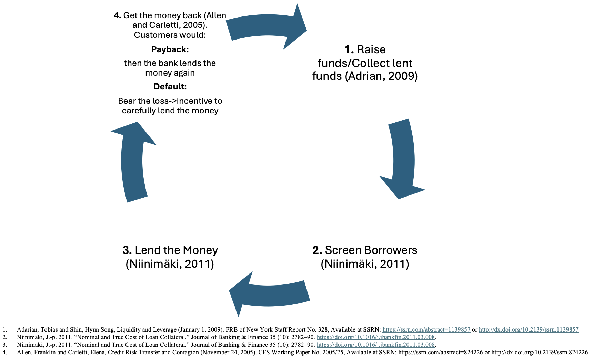
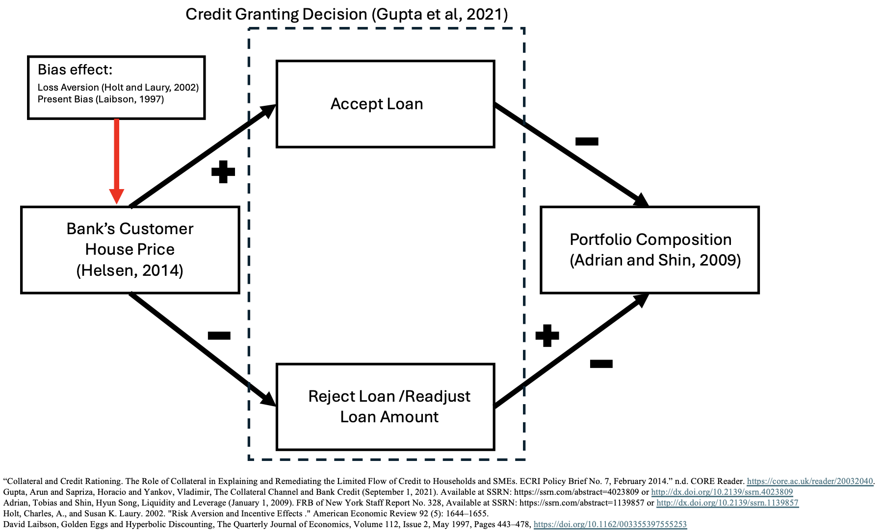
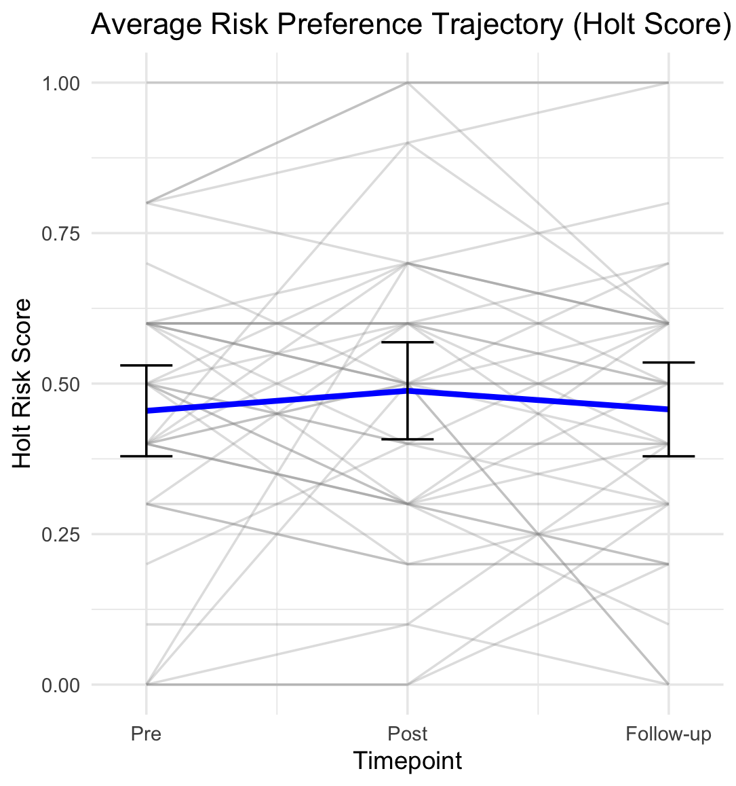

<!-- .slide: class="title-slide" -->
# A Dissection of Collateral’s Bounded Rationality
</section>

---
<!-- .slide: class="slide-heading" -->
## How and to which magnitude can the effect of present bias be decreased in loan granting? TBU

---
<!-- .slide: class="slide-heading" -->
## Trust starts at the first line, misaligned incentives risk shareholders and society.

- **Their role** is to be the first "trustworthiness" filter for the bank.
- They are part of the **first line of defense** of the institution.
- Materialy contribute with the **risk taking** of the bank: information (hard and soft)-loans.

- When incentives are misaligned they can make the bank incurr in **excesive lending**.
- Banks can go bankrupt because of **credit risk** materialization.
- **30%** of loans might get **never recovered** after a bankruptcy.

---
<!-- .slide: class="slide-heading" -->
## ~70% of your Banking Statement is being lend

    - The median bank account balance 5,400.00 (Yahoo Finance)
    - The Loan to Deposit Ratio is 0.71 (71 cents loaned per dolar deposited - Federal Reserve)

---
<!-- .slide: class="slide-heading" -->
## Who would you rather decide where to lend your money?

  
  

---
<!-- .slide: class="slide-heading" -->
## The "Rational" Banking process

  

---
<!-- .slide: class="slide-heading" -->
## Heuristics in the Banking Process  (1/2)

 <!-- .element: class="r-stretch" style="max-height:60vh;width:auto;" -->

--
<!-- .slide: class="slide-heading" -->
## Heuristics in the Banking Process (2/2)

 <!-- .element: class="r-stretch" style="max-height:60vh;width:auto;" -->

---
<!-- .slide: class="slide-heading" -->
## The Utility Function

$$
\begin{aligned}
U_t
&=
\sum_{k=1}^{K}\!\left[
  \underbrace{\frac{(c_t^{k})^{1-\rho}}{1-\rho}}_{\text{CRRA level utility}}
  \;+\;
  \underbrace{\mu_k(c_t^{k}, r_t^{k})}_{\text{reference-dependent gain--loss}}
\right] \\
&\quad+\;
\underbrace{\beta \sum_{\tau=t+1}^{T} \delta^{\tau - t} \sum_{k=1}^{K}\!\left[
  \underbrace{\frac{(c_{\tau}^{k})^{1-\rho}}{1-\rho}}_{\text{CRRA level utility}}
  \;+\;
  \underbrace{\mu_k(c_{\tau}^{k}, r_{\tau}^{k})}_{\text{reference-dependent gain--loss}}
\right]}_{\text{present-biased discounted future utility}} \, .
\end{aligned}
$$

<table style="border-collapse:collapse; margin:auto;">
  <thead>
    <tr>
      <th style="border:1px solid #ccc; padding:6px;">Symbol</th>
      <th style="border:1px solid #ccc; padding:6px;">Meaning</th>
    </tr>
  </thead>
  <tbody>
    <tr>
      <td style="border:1px solid #ccc; padding:6px;">$c_t^{k}$</td>
      <td style="border:1px solid #ccc; padding:6px;">Consumption in dimension $k$ at time $t$</td>
    </tr>
    <tr>
      <td style="border:1px solid #ccc; padding:6px;">$r_t^{k}$</td>
      <td style="border:1px solid #ccc; padding:6px;">Reference point in dimension $k$ at time $t$</td>
    </tr>
    <tr>
      <td style="border:1px solid #ccc; padding:6px;">$K$</td>
      <td style="border:1px solid #ccc; padding:6px;">Number of consumption dimensions</td>
    </tr>
    <tr>
      <td style="border:1px solid #ccc; padding:6px;">$T$</td>
      <td style="border:1px solid #ccc; padding:6px;">Time horizon</td>
    </tr>
    <tr>
      <td style="border:1px solid #ccc; padding:6px;">$\rho$</td>
      <td style="border:1px solid #ccc; padding:6px;">CRRA curvature ($\rho\neq 1$)</td>
    </tr>
    <tr>
      <td style="border:1px solid #ccc; padding:6px;">$\beta\in(0,1]$</td>
      <td style="border:1px solid #ccc; padding:6px;">Present-bias factor</td>
    </tr>
    <tr>
      <td style="border:1px solid #ccc; padding:6px;">$\delta\in(0,1)$</td>
      <td style="border:1px solid #ccc; padding:6px;">Per-period discount factor</td>
    </tr>
    <tr>
      <td style="border:1px solid #ccc; padding:6px;">$\mu_k(\cdot)$</td>
      <td style="border:1px solid #ccc; padding:6px;">Gain–loss utility around $r_t^k$</td>
    </tr>
    <tr>
      <td style="border:1px solid #ccc; padding:6px;">$\eta_k&gt;0$</td>
      <td style="border:1px solid #ccc; padding:6px;">Sensitivity scale in $\mu_k$</td>
    </tr>
    <tr>
      <td style="border:1px solid #ccc; padding:6px;">$\lambda_k\ge 1$</td>
      <td style="border:1px solid #ccc; padding:6px;">Loss-aversion weight in $\mu_k$</td>
    </tr>
    <tr>
      <td style="border:1px solid #ccc; padding:6px;">$\alpha_k,\gamma_k\in(0,1]$</td>
      <td style="border:1px solid #ccc; padding:6px;">Gain/loss branch curvatures in $\mu_k$</td>
    </tr>
  </tbody>
</table>

**Typical branch form**
$$
\mu_k(c,r)=\eta_k\,\big[(c-r)_+^{\alpha_k} - \lambda_k\, (-(c-r)_-)^{\gamma_k}\big].
$$

--
<!-- .slide: class="slide-heading" -->
## The decision Rule our Decision Maker Follows

Utility function for each potential scenario:
- When Right:
  - $U_1$, when $\mathop{\mathbb{E}}(P_a)$ when customer expected probability $P_i$ is read as it landed above the threshold and that it was accepted.
  - $U_4$ , when $\mathop{\mathbb{E}}(P_b)$ of the expected repayment probability $P_i$, given by $(1-P_a)$ is read as it landed below the threshold and that it was rejected.

- When Wrong:
  - $U_3$ Type I Error
  - $U_2$ Type II Error

Each Scenario Probability of Accepting and rejecting given by:

$$\mathop{\mathbb{E}}\left[U|\text{Accept}\right]=P_aU_1+P_bU_2$$
$$\mathop{\mathbb{E}}\left[U|\text{Reject}\right]=P_aU_3+P_bU_4$$

In a multi-scenario task the decision maker will rank the utilities from the highest to the lowest.

--
## Intertemporal Choice Component (Laibson, 1997)

$$U_t = u(c_t) + \beta \sum_{\tau = t+1}^{T} \delta^{\tau - t} u(c_\tau)$$

Where,

- $u(c_t)$ : instant utility from consumption $c_t$
- $\beta$ : present-bias parameter $\beta \in(0,1]$
- $\delta$ : discount factor $\delta\in(0,1)$
- $T$ : the time horizon

--

## Reference-Dependent Preferences (Koszegi and Rabin, 2006)

$$U(c \mid r) = m(c) + \sum_{k=1}^{K} \mu_k \left[ m_k(c_k) - m_k(r_k) \right]$$

Where,

- $c=(c^1,...,C^K)$ : vector over k dimensions
- $c^k$ : realized outcome in k dimension
- $m(c)$ : total consumption utility $\sum_{k=1}^{K} m_k(c_k)$
- $r^k$ : agent's rational outcome expectations on $c^k$
- $m^k(\cdot)$ : consumption utility function for k dimension
- $\mu_k(\cdot)$ : the gain-loss utility function*

--

## Gain–Loss Utility Function Capturing Reference Dependence (Kőszegi & Rabin, 2006)

$$
\mu_k(x)=
\begin{cases}
\eta_k\,x,            & \text{if } x \ge 0 \quad \text{(gain)}\\[4pt]
\eta_k\,\lambda_k\,x, & \text{if } x < 0 \quad \text{(loss)}
\end{cases}
$$

Where,

- $\eta_k$: scale of sensitivity to gains/losses  
- $\lambda_k$: loss aversion parameter

--

## Adjusting the deviation-based structure with a CRRA form

$m^k(c^k)$ is replaced with $u(c^k)$

Giving:

$$
\mu_k(c_k,r_k)=
\begin{cases}
\eta_k\,x_k^{\alpha_k},                & \text{if } x_k \ge 0 \quad \text{(gain)}\\[4pt]
-\eta_k\,\lambda_k\,(-x_k)^{\gamma_k}, & \text{if } x_k < 0 \quad \text{(loss)}
\end{cases}
\qquad \text{with } x_k=c_k-r_k.
$$

Where,
- $\eta_k>0$: sensitivity factor  
- $\lambda_k \ge 1$: loss-aversion parameter  
- $\alpha_k \in (0,1]$: gains  
- $\gamma_k \in (0,1]$: losses

--

## Hybrid Model (quasi-hyperbolic discounting with explicit risk preferences)

$$U_t = \sum_{k=1}^{K} \left[ \frac{(c_{t}^{k})^{1 - \rho}}{1 - \rho} + \mu_k(c_{t}^{k}, r_{t}^{k}) \right] + \beta \sum_{\tau = t+1}^{T} \delta^{\tau - t} \sum_{k=1}^{K} \left[ \frac{(c_{\tau} ^{k})^{1 - \rho}}{1 - \rho} + \mu_k(c_{\tau}^{k}, r_{\tau}^{k}) \right]$$

--

## To be Consistent with De Clippel Ancillary Conditions

- $A_t$: available menu
- $F(A_t)$: feasible attention sets
- $S_t \subseteq A_t$: consideration set endogenously chosen
- feasible utility path:

  $$
  \tilde{U}_t=\max_{c_t\in S_t}\left[ u(c_t \mid r_t)
  + \beta \sum_{\tau=t+1}^{T} \delta^{\tau-t}\,
  \mathbb{E}_{S_\tau}\!\left[ u(c_\tau \mid r_\tau) \right] \right]
  $$

- $\Theta_t$: a point given at time $t$
- $u(c_t \mid r_t)\ge \theta_t$: satisfaction point
- Constrained to $c_t \in S_t \subseteq A_t$

$$
U_t=\sum_{k=1}^{K}\left[\frac{(c_t^{k})^{1-\rho}}{1-\rho}+\mu_k(c_t^{k},r_t^{k})\right]
+\beta\sum_{\tau=t+1}^{T}\delta^{\tau-t}\sum_{k=1}^{K}\left[\frac{(c_\tau^{k})^{1-\rho}}{1-\rho}+\mu_k(c_\tau^{k},r_\tau^{k})\right]
$$

---
<!-- .slide: class="slide-heading" -->
## A Blur in the Perceived Feasibility Frontier

  
  

--
<!-- .slide: class="slide-heading" -->
## The effect of an Ancillary condition "d" (Clippel, Nd)

- $\Psi$ : bias (present bias)
- $\lambda$ : risk preference
- Decision set:

$$L=C(\{ x,y \}, \Psi, \lambda) \textnormal{ where, } (x,y)\in \mathbb{R}^2_+ $$

And the frontier:

$$y=\left(1-\left(\frac{x}{\psi}\right)^{1-\lambda}\right)^{1-\lambda}$$

--
<!-- .slide: class="slide-heading" -->
## The Frontier perception shift and inter-temporal effect

- Distorded decision set:
$$\psi_t=\psi(\psi_{t-1},A_t)$$
- Inter-temporal effect of time dependency:
$$\text{where, } x\in [0,\psi_t] \text{ and, } \lambda \in (0,1)$$

---
<!-- .slide: class="slide-heading" -->
## Experimental Design

- Lab Experiment
- Field Experiment

--
<!-- .slide: class="slide-heading" -->
## Our Lab Experiment

<table style="border-collapse:collapse; margin:auto;">
  <thead>
    <tr>
      <th style="border:1px solid #ccc; padding:6px;"></th>
      <th colspan="2" style="border:1px solid #ccc; padding:6px; text-align:center;">Time Delay</th>
    </tr>
    <tr>
      <th style="border:1px solid #ccc; padding:6px; text-align:left;">Incentive Adjustment</th>
      <th style="border:1px solid #ccc; padding:6px; text-align:center;">Yes</th>
      <th style="border:1px solid #ccc; padding:6px; text-align:center;">No</th>
    </tr>
  </thead>
  <tbody>
    <tr>
      <td style="border:1px solid #ccc; padding:6px;"><strong>Yes</strong></td>
      <td style="border:1px solid #ccc; padding:6px; text-align:center;">Treatment 3</td>
      <td style="border:1px solid #ccc; padding:6px; text-align:center;">Treatment 2</td>
    </tr>
    <tr>
      <td style="border:1px solid #ccc; padding:6px;"><strong>No</strong></td>
      <td style="border:1px solid #ccc; padding:6px; text-align:center;">Treatment 1</td>
      <td style="border:1px solid #ccc; padding:6px; text-align:center;">Control</td>
    </tr>
  </tbody>
</table>

--
<!-- .slide: class="slide-heading" -->
## The Subject's Measures

- Risk Aversion (Holt and Laury, 2002)
- Short-term Impatience (Andreoni, 2012)
- Risk Seeking (Eckel and Grossman, 2002)
- DOSPERT - Risk Taking (Blais and Weber, 2006)

--
<!-- .slide: class="slide-heading" -->
## A Decision Making Situation

- Loan Officer Training in 5 minutes
- Decision making - rank from most to least chances of repayment (5 decisions)

<section>
  

    <!-- Panel: Application -->
    

      
CREDIT APPLICATION A

      

        <table style="width:100%; border-collapse:separate; border-spacing:0 8px; font-family: ui-monospace, SFMono-Regular, Menlo, Monaco, Consolas, 'Liberation Mono', monospace;">
          <tr><td style="color:#5b6573;">Amount Requested</td><td style="text-align:right; font-weight:700;">$10,000.00</td></tr>
          <tr><td style="color:#5b6573;">Term</td><td style="text-align:right;">36 periods</td></tr>
          <tr><td style="color:#5b6573;">Payment Frequency</td><td style="text-align:right;">Monthly X</td></tr>
          <tr><td style="color:#5b6573;">Installment (payment)</td><td style="text-align:right; font-weight:700;">$346.65</td></tr>
          <tr><td style="color:#5b6573;">Purpose of Credit</td><td style="text-align:right;">Consumer</td></tr>
          <tr><td style="color:#5b6573;">Type of Collateral</td><td style="text-align:right;">Mortgage-backed</td></tr>
          <tr><td style="color:#5b6573;">Source of Income</td><td style="text-align:right;">Private employee (5 years)</td></tr>
          <tr><td style="color:#5b6573;">Score</td><td style="text-align:right;">AAA (950; positive bureau history – 10 years)</td></tr>
          <tr><td style="color:#5b6573;">Total Consolidated Risk</td><td style="text-align:right; font-weight:700;">$10,000.00</td></tr>
        </table>
      

    

    <!-- Panel: Payment Capacity Analysis -->
    

      
Payment Capacity Analysis

      

        <table style="width:100%; border-collapse:separate; border-spacing:0 6px; margin-bottom:12px; font-family: ui-monospace, SFMono-Regular, Menlo, Monaco, Consolas, 'Liberation Mono', monospace;">
          <thead>
            <tr>
              <th style="text-align:left; color:#5b6573;">Assets</th>
              <th style="text-align:right; color:#5b6573;">Value</th>
              <th></th>
              <th style="text-align:left; color:#5b6573;">Liabilities</th>
              <th style="text-align:right; color:#5b6573;">Value</th>
            </tr>
          </thead>
          <tbody>
            <tr><td>Real Estate</td><td style="text-align:right;">$20,000.00</td><td></td><td>Secured Bank Debt</td><td style="text-align:right;">$19,120.89</td></tr>
            <tr><td>Other Assets</td><td style="text-align:right;">$10,000.00</td><td></td><td>Short-Term Liabilities</td><td style="text-align:right;">$953.75</td></tr>
          </tbody>
        </table>

        <table style="width:100%; border-collapse:separate; border-spacing:0 6px; font-family: ui-monospace, SFMono-Regular, Menlo, Monaco, Consolas, 'Liberation Mono', monospace;">
          <thead>
            <tr>
              <th style="text-align:left; color:#5b6573;">Income / Expense</th>
              <th style="text-align:right; color:#5b6573;">Amount</th>
              <th></th>
              <th style="text-align:left; color:#5b6573;">Income / Expense</th>
              <th style="text-align:right; color:#5b6573;">Amount</th>
            </tr>
          </thead>
          <tbody>
            <tr><td>Income</td><td style="text-align:right;">$1,247.55</td><td></td><td>Financial Expenses</td><td style="text-align:right;">$459.80</td></tr>
            <tr><td>Family Expenses</td><td style="text-align:right;">$98.00</td><td></td><td>Net Savings</td><td style="text-align:right; font-weight:700;">$689.75</td></tr>
            <tr><td style="color:#5b6573;">Total Expenses</td><td style="text-align:right;">$557.80</td><td></td><td></td><td></td></tr>
          </tbody>
        </table>

      

    

  

</section>

--
<!-- .slide: class="slide-heading" -->
## The Field Experiment

1. Loan Officers undergo a "regular" workshop.
2. Fill surveys (behavioral traits).
3. They have to make decision sets
4. Start an unrelated training.
5. HR provides Stimuli
6. They have to make decisions sets

---
<!-- .slide: class="slide-heading" -->
## Preliminary Results

| Category              | Details                                                                 |
|----------------------|--------------------------------------------------------------------------|
| Participants (n)     | 42 loan officers                                                         |
| Age range            | 25–45 years                                                              |
| Gender               | 17 male, 25 female                                                       |
| Experience (role)    | 2 months – 10 years                                                      |
| Context              | During a scheduled training                                              |
| Instruments          | DOSPERT test; Holt–Laury risk test                                       |
| Decision sets        | Based on current bank standards, pre & post stimuli                      |
| Stimulus             | HR announced a change to bonus calculation (vs. status quo)              |

--

| Outcome                                  | Result / Interpretation                                                                 |
|------------------------------------------|------------------------------------------------------------------------------------------|
| Loan decision accuracy                    | Increased from 46% to 53% when present bias was deactivated                             |
| Collective risk preferences               | Shifted in the very short term, then converged back toward baseline                     |
| Statistical power                         | Study underpowered; ~290 participants estimated for statistical significance            |

--

<!-- .slide: class="slide-heading" -->
## Better Decision Makers (In Average)

<!-- .slide: class="img-center" -->

  

--

<!-- .slide: class="slide-heading" -->
## Less willing to take risks (for a bit)

<!-- .slide: class="img-center" -->

  

---
<!-- .slide: class="slide-heading" -->
## Empirical Strategy Using MLE

**From the Experiments**
- Risk (Holt–Laury $R^{HL}$
- Eckel–Grossman $R^{EG}$
- DOSPERT $R^{DOS}$
- Impatience $S^{imp}$
- Delay indicator $D$

--

## From Theory to Econometrics (Ordered Probit)

**Latent index** for trial $i$ (subject $g$):

$$
y_i^\ast = m_i'\beta + \varepsilon_i, \qquad \varepsilon_i \sim \mathcal{N}(0,1)
$$

Observed category $y_i \in \{1,\dots,J\}$ via cutpoints  
$\mu_0=-\infty < \mu_1 < \dots < \mu_{J-1} < \mu_J=+\infty$:

$$
P(y_i=j) = \Phi(\mu_j - m_i'\beta) - \Phi(\mu_{j-1} - m_i'\beta)
$$

**Design of $m_i$ (links model → data):**

- **Present bias:** $D_i$, $S^{imp}_g$, $D_i \times S^{imp}_g$
- **Risk:** $R^{HL}_g$, $R^{EG}_g$, $R^{DOS}_g$
- **Task features:** stakes, variance, information load, time pressure; engineered from $u(c)$ and $\mu_k(\cdot)$
- **Heteroskedasticity:**  
  $\mathrm{Var}(\varepsilon_i)=\sigma_i^2=\exp(w_i'\kappa)$  
  $\Rightarrow\; P(y_i=j)=\Phi\!\Big(\frac{\mu_j-m_i'\beta}{\sigma_i}\Big)-\Phi\!\Big(\frac{\mu_{j-1}-m_i'\beta}{\sigma_i}\Big)$

**Panel heterogeneity:**  
Random intercept $b_g\sim\mathcal{N}(0,\sigma_b^2)$  
$$
y_{ig}^\ast = m_{ig}'\beta + b_g + \varepsilon_{ig}.
$$

--

## Estimation, Tests, and Extensions (MLE / QMLE)

**Log-likelihood** (maximize over $\beta$, $\mu$, and optionally $\kappa$, $\gamma_j$, $\sigma_b^2$):

$$
\ell = \sum_{i=1}^n \sum_{j=1}^J 
\mathbf{1}\{y_i=j\} \,
\log \Big[
\Phi(\mu_j - m_i'\beta) - \Phi(\mu_{j-1} - m_i'\beta)
\Big]
$$

- **Inference:** Fisher or observed information; robust (sandwich) SEs for QMLE.
- **Identification:** ordered scale (fix $\mathrm{Var}(\varepsilon)=1$.

--

**Key hypotheses (link to behavioral theory):**

- *Present bias:* $H_0:\; D=0,\; S^{imp}=0,\; D\times S^{imp}=0$
- *Risk channels:* joint Wald test on $(R^{HL}, R^{EG}, R^{DOS})$
- *Panel heterogeneity:* $H_0:\; \sigma_b^2 = 0$

**Extensions:**

- **Correctness linkage:** bivariate (ordered probit + probit) with $\mathrm{Corr}(\varepsilon,\nu)=\rho$
- **Ranked decisions:** Plackett–Luce (exploded logit) or composite *pairwise probit*
- **Reporting:** marginal effects by delay/impatience, threshold plots, subject-level random effects, predictive accuracy.

---
<!-- .slide: class="slide-heading" -->
## Q&A