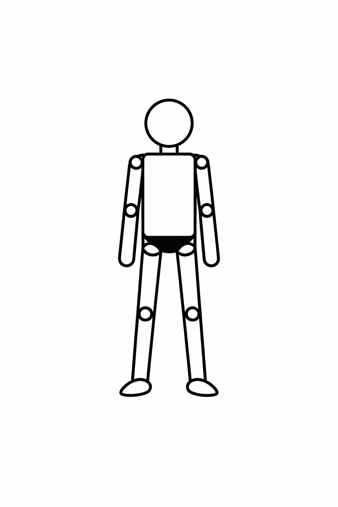

<!-- .slide: class="title-slide" -->
# The Institutional Decision Maker: An Artificial-Collective Approach.
</section>

---
<!-- .slide: class="slide-heading closer" -->
## What does this research do?

  

--
<!-- .slide: class="slide-heading closer" -->
## But, how?

  

--
<!-- .slide: class="slide-heading closer" -->
## But, how?

  

---
<!-- .slide: class="slide-heading closer" -->
## Justification

  <!-- Top label -->
  

    Established Strategic Lenses1
  

  <!-- Top row -->
  

    

      Resource-Based View
    

    

      Dynamic Capabilities
    

    

      Transaction Costs
    

    

      Agency
    

    

      Cognition
    

  

  <!-- Converging neck -->
  

    

  

  <!-- Center bottleneck -->
  

    

  

  

    

      

        Firm Decision Machinery2
      

      

        How individual decision-making become collective organizational choice
      

      

        Preferences
        Information
        Authority - Influence
      

    

  

  <!-- Diverging neck -->
  

    

  

  

    

  

  <!-- Bottom output -->
  

    

      

        Firm-Level Decision3
      

      

        Competitive Advantage / Superior Performance4
      

    

  

  <!-- Takeaway -->
  

    The literature explains why firms differ, but is less explicit about how firms decide.
  

  <!-- Footnotes -->
  

    1 Barney (1991); Teece, Pisano, and Shuen (1997); Nickerson and Silverman (2003); March (1991); Eisenhardt (1989).&nbsp;&nbsp;
    2 Powell, Lovallo, and Fox (2011).&nbsp;&nbsp;
    3 Leiblein, Reuer, and Zenger (2018).&nbsp;&nbsp;
    4 Lieberman (2021); Barney, Mackey, and Mackey (2023).
  

---
<!-- .slide: class="slide-heading closer" -->
## The Research Question

  

    

      What is the machinery thay allows the firm to behave and decide as an individual-like decision-maker?
    

    

    

      That is, how are multiple individual preferences, information, incentives, and authority transformed into a unified firm choice?
    

  

---

<!-- .slide: class="slide-heading" -->
## The Individual Decision Maker

  

--

## The Individual Decision Maker

  

    Individual behavior inside the firm is a culturally mediated, incentive-sensitive, boundedly-rational.
  

  

    

      

        1. Culture1
      

      

        Shapes what the agent <strong>perceives</strong>, how actions are <strong>interpreted</strong>, and how outcomes are <strong>valued</strong> before choice occurs.
      

    

    

      ↓
    

    

      

        2. Incentives2
      

      

        Shape <strong>internal effort allocation</strong> within any candidate action, splitting attention between the <strong>firm-desired task</strong> and <strong>distracting or private-return activity</strong>.
      

    

    

      ↓
    

    

      

        3. Bounded Rationality3
      

      

        Replaces global optimization with <strong>aspiration-based search</strong>: the agent stops at the <strong>first satisfactory alternative</strong> rather than solving for the global optimum.
      

    

  

  

    1 Martinez et al. (2015).&nbsp;&nbsp;
    2 Gibbons (1998).&nbsp;&nbsp;
    3 Simon (1955, 1987, 2000).
  

--
## Analytical Generalities of the Individual Actor

  

    The unified individual-level object combines culturally mediated valuation, internal effort allocation, and aspiration-based choice.1,2,3
  

  

    <!-- Block 1 -->
    

      

        1. Objective Inputs
      

      

        
\(a \in A_{it}^{\circ}(K_i)\): candidate action

        
\(s_t\): objective state

        
\(C_i=(R_i,K_i)\): culture

      

    

    
→

    <!-- Block 2 -->
    

      

        2. Cultural Mediation
      

      

        
Perceived state:

        
\(\hat{s}_{it}=\mu_i(s_t;K_i)\)

        
Interpreted action:

        
\(\hat{a}_{it}=\gamma_i(a,\hat{s}_{it};K_i)\)

        
Valuation:

        
\(U_i(\hat{a}_{it},\hat{s}_{it};R_i)\)

      

    

    
→

    <!-- Block 3 -->
    

      

        3. Internal Effort Allocation
      

      

        
\(e_{1it}\): firm-desired effort

        
\(e_{2it}\): distracting/private-return effort

        

          \(e_{1it}^*(a)=\dfrac{c_{2i}b_i-d_i\eta_i}{\Delta_i}\)
        

        

          \(e_{2it}^*(a)=\dfrac{c_{1i}\eta_i-d_i b_i}{\Delta_i}\)
        

      

    

  

  

    ↓
  

  

    <!-- Block 4 -->
    

      

        4. Indirect Behavioral Value Function
      

      

        \(W_{it}(a;s_t,C_i)\)
      

      

        Measures the subjective value of candidate action \(a\) after
        <strong>cultural mediation</strong> and
        <strong>optimal internal effort allocation</strong>.
      

    

    
→

    <!-- Block 5 -->
    

      

        5. Aspiration-Based Choice
      

      

        Select the first action such that
      

      

        \(W_{it}(a_{ij};s_t,C_i)\geq k_{it}\)
      

      

        Search proceeds over the culturally mediated considered set,
        and aspirations update with search feedback.
      

    

  

  

    Aspiration dynamics: \(k_{i,t+1}=k_{it}+\phi_i(m_{it})\)
  

  

    Formally, individual behavior inside the firm is represented by an indirect behavioral value function coupled with an aspiration-based stopping rule.
  

  

    1 Martinez et al. (2015).&nbsp;&nbsp;
    2 Gibbons (1998).&nbsp;&nbsp;
    3 Simon (1955, 1987, 2000).
  

---

<!-- .slide: class="slide-heading" -->
## The Collective Decision-Making

  

--

## From Individual to Collective Decision-Making

  

    The firm becomes a "collective-individual" not because internal frictions disappear, but because they are reorganized into coordinated decision structures (syndicate of syndicates).
  

  

    

      

        1. Dynamic Incentives1
      

      

        Current effort and disclosure depend on <strong>continuation values</strong>, <strong>belief updating</strong>, and the intertemporal consequences of present performance.
      

    

    

      ↓
    

    

      

        2. Coalition Structures2
      

      

        Owners, managers, and employees remain <strong>differentiated actors</strong>; collective action depends on how heterogeneous interests are <strong>organized</strong>, not on their disappearance.
      

    

    

      ↓
    

    

      

        3. Managerial Mediation &amp; Relational Cooperation3
      

      

        Managers translate <strong>incomplete contracts</strong> into subordinate effort and execution, while coalition cooperation depends on <strong>credible disclosure</strong>, <strong>reciprocity</strong>, and <strong>relational signals</strong>.
      

    

    

      ↓
    

    

      

        4. Shared Frames &amp; Interpretation4
      

      

        Collective performance depends on a <strong>shared cognitive frame</strong> through which members classify the strategic environment and interpret what situation the firm is facing.
      

    

  

  

    1 Gibbons (1987); Gibbons and Murphy (1992).&nbsp;&nbsp;
    2 Simon (1947); Cohen (2007); Gavetti (2012).&nbsp;&nbsp;
    3 Rotemberg and Saloner (1989); Rotemberg (1994); Simon (1983); Rotemberg and Saloner (1993).&nbsp;&nbsp;
    4 Gibbons, LiCalzi, and Warglien (2021).
  

--
## Analytical Generalities of the Collective Actor

  

    Once coalitions are representable as surrogate evaluative units, the firm becomes a syndicate of syndicates with a tractable collective utility and choice rule.1
  

  <!-- top coalition layer -->
  

    

      

        Coalition \(g_1\)
      

      

        surrogate utility \(V_{g_1}(\cdot)\)
      

      

        risk tolerance \(R_{g_1}(z)\)
      

    

    

      

        Coalition \(g_2\)
      

      

        surrogate utility \(V_{g_2}(\cdot)\)
      

      

        risk tolerance \(R_{g_2}(z)\)
      

    

    

      

        Coalition \(g_3 \in \mathcal{G}\)
      

      

        surrogate utility \(V_{g_3}(\cdot)\)
      

      

        risk tolerance \(R_{g_3}(z)\)
      

    

  

  <!-- convergence -->
  

    

  

  <!-- center aggregation box -->
  

    

      

        Firm as Syndicate of Syndicates
      

      

        Inter-coalition allocations satisfy
      

      

        \[
        \sum_{g\in\mathcal{G}} \Lambda_g(\mathcal{Y},\upsilon)=\mathcal{Y}
        \]
      

      

        Aggregate risk tolerance
      

      

        \[
        R_{\mathcal F}(\mathcal{Y},\upsilon)=\sum_{g\in\mathcal{G}}R_g\!\bigl(\Lambda_g(\mathcal{Y},\upsilon)\bigr)
        \]
      

    

  

  <!-- downward connector -->
  

    ↓
  

--

  <!-- output layer -->
  

    

      

        Firm-Level Surrogate Utility and Collective Choice
      

      

        Surrogate utility
      

      

        \[
        V_{\mathcal F}(\mathcal{Y})
        =
        A+B\int^{\mathcal{Y}}\exp\!\left(-\int^{t}\frac{ds}{R_{\mathcal F}(s)}\right)dt
        \]
      

      

        Collective choice rule
      

      

        \[
        d_{\mathcal F}^* \in \arg\max_{d_{\mathcal F}} \;
        \mathbb{E}_{\upsilon}\!\left[
        V_{\mathcal F}\!\bigl(H(\upsilon,d_{\mathcal F})\bigr)
        \right]
        \]
      

    

  

  

    The collective actor of the firm is not primitive but emergent: unity of choice is obtained through coalition-level aggregation into a tractable surrogate objective.
  

  

    1 Wilson (1968).
  

---

<!-- .slide: class="slide-heading" -->
## The Institutional-Individual Decision-Maker

  

--

## Evaluative Unity and Decisional Unity

  

    The firm becomes individual-like only when a unified evaluative criterion and a coordinated rule of choice coincide under a given organizational information structure.
  

  

    <!-- Left pillar -->
    

      

        Evaluative Unity1
      

      

        
• Coalition plurality is <strong>aggregated</strong> into a firm-level evaluative object.

        
• The firm can <strong>rank outcomes</strong> through a surrogate utility.

        
• Internal heterogeneity is preserved, but translated into a <strong>common criterion of evaluation</strong>.

      

    

    <!-- Right pillar -->
    

      

        Decision Coordination2
      

      

        
• Distributed positions hold <strong>fragmented signals</strong> and differentiated tasks.

        
• The firm acts through a <strong>team decision rule</strong> over organizational histories.

        
• Organizational choice is induced by <strong>architecture</strong>, not by a literal single mind.

      

    

  

  <!-- Convergence -->
  

    

  

  

    

  

  <!-- Synthesis -->
  

    

      

        Firm as Individual-Like Decision-Maker
      

      

        The firm-level act is neither the choice of a single mind nor an unstructured coalition compromise:
        it is a coordinated organizational act evaluated by a unified firm-level criterion.
      

    

  

  <!-- Architecture band -->
  

    

      Information Architecture2,3
    

    

      observation • communication • delegation • reporting • memory
    

  

  

    Internal plurality is transformed, not eliminated.
  

  

    1 Wilson (1968).&nbsp;&nbsp;
    2 Marschak and Radner (1972).&nbsp;&nbsp;
    3 Cyert and March (1963, chs. 4, 6, 9).
  

--
## Analytical Generalities of the Firm-Individual

  

    A firm is representable as an individual decision-maker when a unified surrogate utility evaluates a best team decision rule induced by the organization’s information structure.1,2
  

  

    <!-- Stage 1 -->
    

      

        1. Architecture &amp; Histories2,3
      

      

        
organizational architecture:

        
\(\mathfrak{A}_t=(\mathfrak{F}_t,\mathfrak{C}_t,\mathfrak{D}_t,\mathfrak{P}_t)\)

        
admissible histories:

        
\(h_t\in\mathcal{H}_t(\mathfrak{A}^t)\)

        
distributed signals are filtered through observation, reporting, and communication.

      

    

    
→

    <!-- Stage 2 -->
    

      

        2. Coordinated Team Rule2
      

      

        firm-level decision function
      

      

        \[
        \delta_t:\mathcal H_t(\mathfrak A^t)\to \mathcal D_t^{\mathcal F}(\mathfrak A_t)
        \]
      

      

        realized firm act
      

      

        \[
        d_t^{\mathcal F}=\delta_t(h_t)
        \]
      

      

        The firm acts through an admissible organizational rule over distributed information.
      

    

    
→

    <!-- Stage 3 -->
    

      

        3. Firm-Level Evaluation1
      

      

        evaluative object
      

      

        \[
        V_{\mathcal F}\!\bigl(H(\upsilon_t,d_t^{\mathcal F})\bigr)
        \]
      

      

        A unified surrogate utility ranks the outcomes produced by the coordinated firm act.
      

    

  

  

    ↓
  

  <!-- Unification step -->
  

    

      

        Unification: Best Firm-Level Team Decision Function
      

      

        \[
        \delta_t^*
        \in
        \arg\max_{\delta_t\in\mathcal T_t(\mathfrak A^t)}
        \mathbb E\!\left[
        V_{\mathcal F}\!\bigl(H(\upsilon_t,\delta_t(h_t))\bigr)
        \,\middle|\,
        h_t,\mathfrak A_t
        \right]
        \]
      

      

        This is the point at which <strong>evaluative unity</strong> and <strong>decisional unity</strong> coincide.
      

    

  

  <!-- Supporting modules -->
  

    

      

        Person-by-Person Satisfactoriness2
      

      

        If \(\delta_t=(\delta_{pt})_{p\in\mathcal P}\), no admissible unilateral deviation by any position improves expected firm-level evaluation.
      

    

    

      

        Dynamic Extension2,3
      

      

        \[
        h_t=\Psi_t(h_{t-1},m_t;\mathfrak A_t)
        \]
      

      

        \[
        \hat{\upsilon}_{t+1\mid t}^{\mathcal F}
        =
        \mathbb E\!\left[
        \upsilon_{t+1}\mid h_t,\mathfrak A_t
        \right]
        \]
      

    

  

  

    Formally, the firm becomes an individual entity when a unified surrogate utility evaluates a coordinated team rule induced by the organization’s information structure.
  

  

    1 Wilson (1968).&nbsp;&nbsp;
    2 Marschak and Radner (1972).&nbsp;&nbsp;
    3 Cyert and March (1963, chs. 4, 6, 9).
  

---

<!-- .slide: class="slide-heading" -->
## Conslusions

  

    The firm becomes individual-like not by ceasing to be plural, but by organizing plurality into coherent evaluation and coordinated choice.
  

  <!-- top inputs -->
  

    

      

        Individuals Inside the Firm
      

      

        culturally mediated 
        incentive-sensitive 
        boundedly rational
      

    

    

      

        Coalitions Inside the Firm
      

      

        heterogeneous interests 
        cooperation &amp; mediation 
        shared frames
      

    

    

      

        Organizational Architecture
      

      

        distributed signals 
        communication &amp; delegation 
        reporting &amp; memory
      

    

  

  <!-- convergence -->
  

    

  

  

    

  

  <!-- synthesis -->
  

    

      

        Strategic Result
      

      

        The firm becomes individual-like when <strong>boundedly rational individuals</strong>,
        <strong>coalition plurality</strong>, and <strong>organizational architecture</strong>
        are transformed into a <strong>unified evaluative criterion</strong> and a
        <strong>coordinated rule of choice</strong>.
      

    

  

  

    The black box between individual cognition and firm performance is firm-organizational decision-making.
  

--
## What This Adds to Strategy?

  

    Competitive advantage depends not only on what the firm has, but also on how the firm is organized to evaluate and choose.
  

  

    <!-- Left column -->
    

      

        Strategy Often Explains
      

      

        
Resources

        
Capabilities

        
Incentives

        
Performance Differences

      

    

    <!-- Center arrow -->
    

      →
    

    <!-- Right column -->
    

      

        This Presentation Adds
      

      

        
Organizational Decision Machinery

        
Evaluative Unity

        
Decisional Unity

        
Firm-Level Decision Quality

      

    

  

  <!-- bottom implication band -->
  

    

      Strategic Implication
    

    

      Persistent differences in firm performance may reflect differences not only in assets or incentives,
      but also in <strong>interpretation</strong>, <strong>coordination</strong>,
      <strong>information architecture</strong>, and <strong>organizational evaluation</strong>.
    

  

  

    Strategy should study not only study firm outcomes, but the machinery that produces firm-level choices.
  

---

<!-- .slide: class="slide-heading" -->
## Q&A