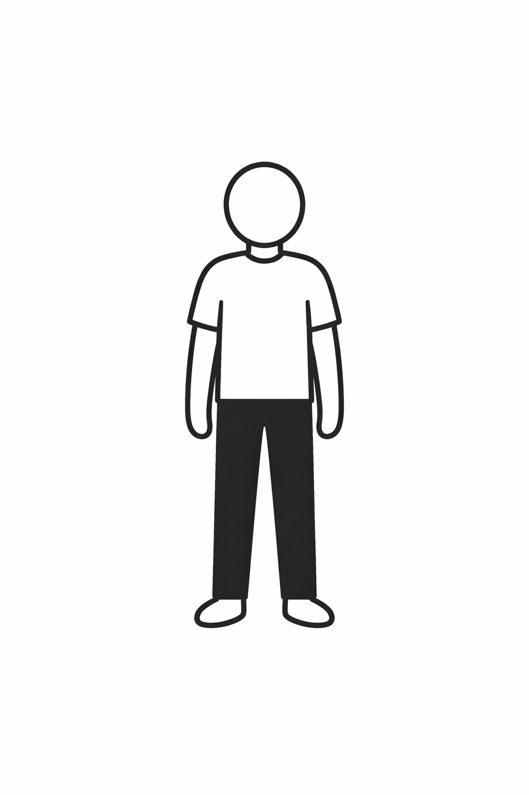
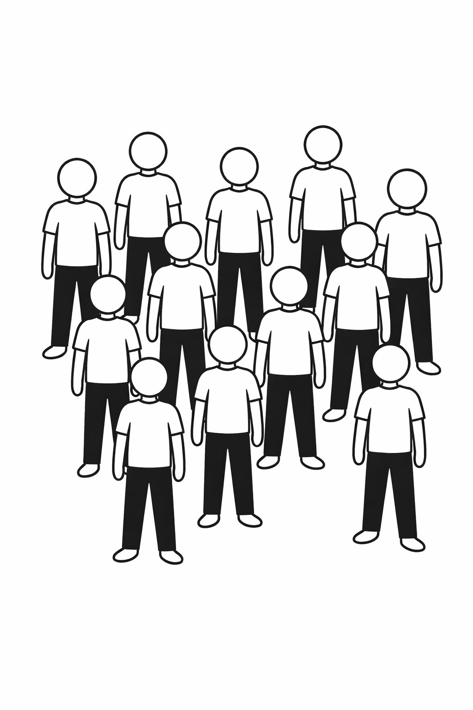

<!-- .slide: class="title-slide" -->
# The Institutional Decision Maker: An Artificial-Collective Approach.
</section>

---
<!-- .slide: class="slide-heading closer" -->
## What does this research do?

  

--
<!-- .slide: class="slide-heading closer" -->
## But, how?

  

--
<!-- .slide: class="slide-heading closer" -->
## But, how?

  

---
<!-- .slide: class="slide-heading closer" -->
## Justification

  <!-- Top label -->
  

    Established Strategic Lenses1
  

  <!-- Top row -->
  

    

      Resource-Based View
    

    

      Dynamic Capabilities
    

    

      Transaction Costs
    

    

      Agency
    

    

      Cognition
    

  

  <!-- Converging neck -->
  

    

  

  <!-- Center bottleneck -->
  

    

  

  

    

      

        Organizational Decision Machinery2
      

      

        How individual judgments become collective organizational choice
      

      

        Preferences
        Information
        Authority - Influence
      

    

  

  <!-- Diverging neck -->
  

    

  

  

    

  

  <!-- Bottom output -->
  

    

      

        Firm-Level Decision3
      

      

        Competitive Advantage / Superior Performance4
      

    

  

  <!-- Takeaway -->
  

    The literature explains why firms differ, but is less explicit about how firms decide.
  

  <!-- Footnotes -->
  

    1 Barney (1991); Teece, Pisano, and Shuen (1997); Nickerson and Silverman (2003); March (1991); Eisenhardt (1989).&nbsp;&nbsp;
    2 Powell, Lovallo, and Fox (2011).&nbsp;&nbsp;
    3 Leiblein, Reuer, and Zenger (2018).&nbsp;&nbsp;
    4 Lieberman (2021); Barney, Mackey, and Mackey (2023).
  

---
<!-- .slide: class="slide-heading closer" -->
## Research Questions

<section>
  

  

    

      

        
3

        
Does moving toward a relatively lower-hassle environment improve subsidiary outcomes?

      

      

        
2

        
Does moving into a relatively higher-hassle environment worsen subsidiary outcomes?

      

      

        
1

        
Does directional movement in hassle space help explain multinational subsidiary survival and profitability?

      

    

  

</section>

--
<!-- .slide: class="slide-heading closer" -->
## Hypotheses

  

    

      
Hypothesis 1

      <h3 class="hyp-title">Subsidiary Survival</h3>
      

        Greater hassle-space displacement between the origin country and the host country,
        captured by Δ+i,t and/or
        Δ−i,t,
        is associated with a lower probability of subsidiary survival, allowing for asymmetric effects between upward and downward moves in hassle space.
      

    

    

      
Hypothesis 2

      <h3 class="hyp-title">Subsidiary Profitability</h3>
      

        Greater hassle-space displacement between the origin country and the host country,
        captured by Δ+i,t and/or
        Δ−i,t,
        is associated with lower subsidiary profitability, again allowing for asymmetric effects between upward and downward moves in hassle space.
      

    

  

---
<!-- .slide: class="slide-heading closer" -->
## The Hassle Factor

  

    

      
Definition

      
What it is

      

        A country-attractiveness and business-friction measure developed to capture how burdensome it is to conduct business across countries.
      

    

    

      
Dimensions

      
What it captures

      

        Eleven practical sources of business inconvenience, including safety, visas, transportation, hotels, hygiene, telecom, health risks, language, business facilitation, and climate.
      

    

    

      
Construction

      
How it is built

      

        A comparable country-year scalar score constructed from weighted indicators within a confirmatory-factor framework.
      

    

    

      
Role in this paper

      
Why it matters here

      

        The Hassle Factor provides the empirical raw material: each country-year score becomes the coordinate from which hassle space is later defined.
      

    

  

--
<!-- .slide: class="slide-heading closer" -->
## The Hassle Vector

  

    

      
Coordinate

      
Each country-year is a point in hassle space

      

        The Hassle Factor is no longer treated only as a scalar attribute, but as a coordinate in an abstract metric space.
      

    

    

      
Comparison

      
The relevant contrast is origin versus host

      

        For subsidiary <em>i</em>, the relevant empirical comparison is not the host country in isolation, but the difference between host and origin environments.
      

    

    

      
Displacement

      
The Hassle Vector is the signed difference

      

        It measures movement from the origin country to the host country in hassle space.
      

      

        Δi,t = Hhi,t − Hoi,t
      

    

    

      
Asymmetry

      
The sign of movement matters

      

        The displacement is decomposed into two legs so the model distinguishes upward from downward movement in hassle space.
      

      

        Δ+i,t = max(Δi,t, 0)
         
        Δ−i,t = max(−Δi,t, 0)
      

    

  

---
<!-- .slide: class="slide-heading closer" -->
## Methods

  

    

      
Data

      
Sample and time coverage

      

        The empirical analysis combines the TK panel of Japanese foreign subsidiaries with Hassle Factor country-year data for 2008–2018.
      

    

    

      
Outcomes

      
Subsidiary exit and profitability

      <ul class="m-list">
        <li>Discrete subsidiary survival / exit outcome</li>
        <li>Profitability proxied by log(1 + RevenueUSDi,t)</li>
      </ul>
    

    

      
Models

      
Hazard and profitability specifications

      <ul class="m-list">
        <li>Discrete-time hazard model for exit</li>
        <li>Profitability regression for operating performance</li>
        <li>Key regressors: Hhost, Δ+, Δ−, controls, fixed effects, and duration terms</li>
      </ul>
    

    

      
Inference

      
Dependence is modeled in hassle-space-time

      

        Inference relies on Conley-style robust standard errors, where dependence is defined over the metric space
        (Δ, t) rather than only over physical geography.
      

    

  

---
<!-- .slide: class="slide-heading closer" -->
## Results: Exit Hazard

  

    Baseline discrete-time hazard model for subsidiary exit with Conley standard errors in hassle-space-time (cutoff <strong>b = 2.0</strong>).
  

  

    <table class="res-table res-tight">
      <thead>
        <tr>
          <th>Variable</th>
          <th>Coef.</th>
          <th>S.E.</th>
          <th>z</th>
          <th>p-value</th>
        </tr>
      </thead>
      <tbody>
        <tr>
          <td>Hhost</td>
          <td>-1.3720</td>
          <td>0.0592</td>
          <td>-23.1671</td>
          <td>&lt;0.001</td>
        </tr>
        <tr class="key-row">
          <td>Δ+</td>
          <td>1.2542</td>
          <td>0.1865</td>
          <td>6.7248</td>
          <td>&lt;0.001</td>
        </tr>
        <tr class="key-row">
          <td>Δ−</td>
          <td>-1.1564</td>
          <td>0.1567</td>
          <td>-7.3798</td>
          <td>&lt;0.001</td>
        </tr>
        <tr>
          <td>Japanese ownership share (%)</td>
          <td>-0.0054</td>
          <td>0.0006</td>
          <td>-9.3042</td>
          <td>&lt;0.001</td>
        </tr>
        <tr>
          <td>log(1 + Capital)</td>
          <td>-0.0458</td>
          <td>0.0038</td>
          <td>-12.1275</td>
          <td>&lt;0.001</td>
        </tr>
        <tr>
          <td>Age</td>
          <td>-0.0738</td>
          <td>0.0157</td>
          <td>-4.6911</td>
          <td>&lt;0.001</td>
        </tr>
      </tbody>
    </table>
  

  

    <strong>Interpretation:</strong> upward movement in hassle space increases exit hazard, while downward movement reduces it.
  

  

    Selected coefficients from the baseline hazard specification reported in the paper; full model also includes year effects and duration terms.
  

--
<!-- .slide: class="slide-heading closer" -->
## Results: Profitability

  

    Baseline profitability model with Conley standard errors in hassle-space-time (cutoff <strong>b = 2.0</strong>). Profitability is proxied by <strong>log(1 + RevenueUSDi,t)</strong>.
  

  

    <table class="res-table res-tight">
      <thead>
        <tr>
          <th>Variable</th>
          <th>Coef.</th>
          <th>S.E.</th>
          <th>z</th>
          <th>p-value</th>
        </tr>
      </thead>
      <tbody>
        <tr>
          <td>Hhost</td>
          <td>4.1227</td>
          <td>0.0669</td>
          <td>61.6683</td>
          <td>&lt;0.001</td>
        </tr>
        <tr class="key-row">
          <td>Δ+</td>
          <td>-4.2938</td>
          <td>0.0862</td>
          <td>-49.8347</td>
          <td>&lt;0.001</td>
        </tr>
        <tr class="key-row">
          <td>Δ−</td>
          <td>5.3087</td>
          <td>0.1121</td>
          <td>47.3522</td>
          <td>&lt;0.001</td>
        </tr>
        <tr>
          <td>Japanese ownership share (%)</td>
          <td>-0.0037</td>
          <td>0.0004</td>
          <td>-10.3867</td>
          <td>&lt;0.001</td>
        </tr>
        <tr>
          <td>log(1 + Capital)</td>
          <td>0.1635</td>
          <td>0.0269</td>
          <td>6.0810</td>
          <td>&lt;0.001</td>
        </tr>
        <tr>
          <td>Age</td>
          <td>0.2679</td>
          <td>0.0308</td>
          <td>8.6861</td>
          <td>&lt;0.001</td>
        </tr>
      </tbody>
    </table>
  

  

    <strong>Interpretation:</strong> upward movement in hassle space lowers profitability, while downward movement increases it.
  

  

    Selected coefficients from the baseline profitability specification reported in the paper; full model also includes year fixed effects.
  

--
<!-- .slide: class="slide-heading closer" -->
## Results: Robustness

  

    The asymmetric directional pattern survives alternative specifications controlling for investment intensity and sector composition.
  

  

    <table class="res-table res-tight">
      <thead>
        <tr>
          <th>Model</th>
          <th>Specification</th>
          <th>Hhost</th>
          <th>Δ+</th>
          <th>Δ−</th>
          <th>Joint legs χ²</th>
          <th>Symmetry χ²</th>
        </tr>
      </thead>
      <tbody>
        <tr>
          <td>Hazard</td>
          <td>Investment proxy</td>
          <td>-1.537</td>
          <td>1.437</td>
          <td>-1.337</td>
          <td>786.41</td>
          <td>734.45</td>
        </tr>
        <tr>
          <td>Hazard</td>
          <td>Narrow industry FE</td>
          <td>-1.278</td>
          <td>1.168</td>
          <td>-1.163</td>
          <td>334.01</td>
          <td>75.05</td>
        </tr>
        <tr>
          <td>Hazard</td>
          <td>Broad industry FE</td>
          <td>-1.177</td>
          <td>1.040</td>
          <td>-1.066</td>
          <td>220.17</td>
          <td>128.81</td>
        </tr>
        <tr>
          <td>Profitability</td>
          <td>Investment proxy</td>
          <td>4.276</td>
          <td>-4.401</td>
          <td>5.488</td>
          <td>25349.87</td>
          <td>24622.50</td>
        </tr>
        <tr>
          <td>Profitability</td>
          <td>Narrow industry FE</td>
          <td>3.787</td>
          <td>-4.009</td>
          <td>5.077</td>
          <td>2240.06</td>
          <td>2219.04</td>
        </tr>
        <tr>
          <td>Profitability</td>
          <td>Broad industry FE</td>
          <td>4.297</td>
          <td>-4.435</td>
          <td>5.743</td>
          <td>4428.73</td>
          <td>3159.69</td>
        </tr>
      </tbody>
    </table>
  

  

    <strong>Interpretation:</strong> the signs of Δ+ and Δ− remain stable across all robustness checks, and both the joint and symmetry tests continue to be strongly rejected.
  

  

    Robustness values are taken directly from the paper’s hazard and profitability robustness tables.
  

--
<!-- .slide: class="slide-heading closer" -->
## Results: Graphical Evidence

  

    

      

        
        
Hassle-space trajectories

      

    

    

      

        
        
Distribution of Δ over time

      

    

    

      

        
        
Dependence decay in hassle-space-time

      

    

  

---
<!-- .slide: class="slide-heading closer" -->
## Conclusions and Contribution

  

    

      
Main finding

      
Direction, not distance alone, organizes outcomes

      

        Subsidiary outcomes are structured by the direction of movement in hassle space: upward moves are associated with higher exit hazard and lower profitability, while downward moves are associated with lower exit hazard and higher profitability.
      

    

    

      
Conceptual contribution

      
From scalar measure to relational construct

      

        The paper transforms the Hassle Factor from a static host-country scalar into a directional relational object defined by the contrast between origin and host environments.
      

    

    

      
Methodological contribution

      
Inference in an abstract economic space

      

        Dependence-robust inference is defined in hassle-space-time, showing that the relevant covariance structure need not be based only on physical geography but can instead be built from an economically meaningful metric space.
      

    

    

      
Broader implication

      
Firms evaluate host environments relatively

      

        Multinational subsidiaries appear to respond not only to absolute host-country burden, but to how burdensome the host environment is relative to the parent firm's origin baseline.
      

    

  

  

    What matters is not only where firms operate, but whether they move upward or downward relative to their origin in hassle space.
  

---

<!-- .slide: class="slide-heading" -->
## Q&A