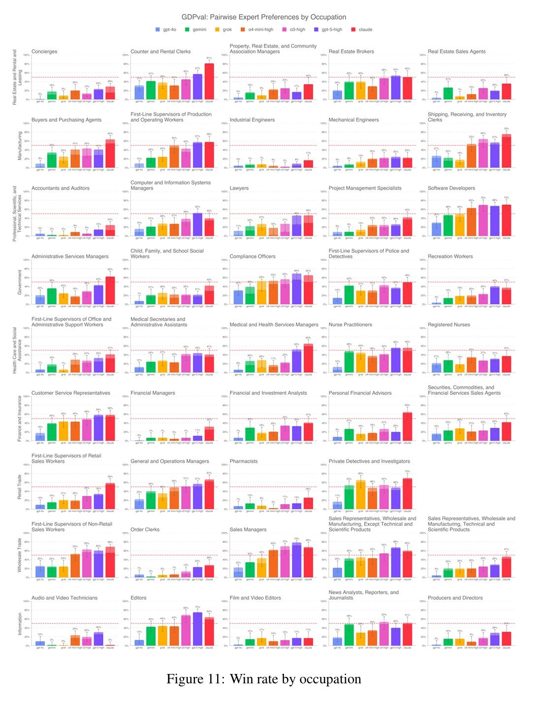

<!-- .slide: class="title-slide" -->
# Uso de Inteligencia Artificial en Educación Superior e Investigación Cientifica

UIDE-Loja-Ecuador | <em>Octubre 13th, 2025</em>

</section>

---

## ¡Disclaimer!

---

## Expectativas IA

  

    <iframe
      data-src="https://www.youtube.com/embed/Ddk9ci6geSs?si=PnTfDzei2cWQ3TmJ&start=60"
      title="YouTube video player"
      frameborder="0"
      allow="accelerometer; autoplay; clipboard-write; encrypted-media; gyroscope; picture-in-picture; web-share"
      referrerpolicy="strict-origin-when-cross-origin"
      allowfullscreen
      style="position:absolute; inset:0; width:100%; height:100%;"
    ></iframe>
  

--

## Realidad IA (un poco...)

  

    <iframe
      data-src="https://www.youtube.com/embed/PZlL5gZeGDI?si=P4x-MeYqjql3C8cj&start=60"
      title="YouTube video player"
      frameborder="0"
      allow="accelerometer; autoplay; clipboard-write; encrypted-media; gyroscope; picture-in-picture; web-share"
      referrerpolicy="strict-origin-when-cross-origin"
      allowfullscreen
      style="position:absolute; inset:0; width:100%; height:100%;"
    ></iframe>
  

---

## ¿Has usado GenAI en tu enseñanza-investigación?

  <iframe
    sandbox='allow-scripts allow-same-origin allow-presentation'
    allowfullscreen='true'
    allowtransparency='true'
    frameborder='0'
    height='315'
    src='https://www.mentimeter.com/app/presentation/alj4s422vk16k5i1wvxon77vpjpfs6yp/embed'
    style='position: absolute; top: 0; left: 0; width: 100%; height: 100%;'
    width='420'>
  </iframe>

--

## ¿Cómo has usado GenAI en tu enseñanza-investigación?

  <iframe
    sandbox='allow-scripts allow-same-origin allow-presentation'
    allowfullscreen='true'
    allowtransparency='true'
    frameborder='0'
    height='315'
    src='https://www.mentimeter.com/app/presentation/alj4s422vk16k5i1wvxon77vpjpfs6yp/embed'
    style='position: absolute; top: 0; left: 0; width: 100%; height: 100%;'
    width='420'>
  </iframe>

---

## ¿Qué es Inteligencia Artificial Generativa?

- Subcampo de la IA que **produce contenido nuevo** (texto, imágenes, código, audio, video).
- Impacta **cómo se produce el conocimiento y los medios**; requiere conocer su potencia y sus límites (AI es generalista por defecto).

---

## ¿Cúales son los Riesgos del Uso de Inteligencia Artificial?

- **Privacidad y exposición de datos:** los prompts pueden incluir datos personales o con derechos.
- **Propiedad intelectual y copyright:** procedencia de datos de entrenamiento poco transparente; salidas que pueden asemejarse a obras con copyright.
- **Sesgos y daño representacional:** modelos que reflejan patrones dominantes y pueden marginalizar variedades no dominantes.
- **Des/misinformación (Halucinaciones):** contenido plausible pero falso/descontextualizado; riesgo de **deepfakes**.

- **Sesgos:** un ejemplo vale más que mil palabras (preferencias nativas).

--

## Sesgos - preferencias nativas

[Open chatgpt.com ↗](https://chatgpt.com){target="_blank" rel="noopener"}

--

- ## AI no es tan inteligente como pensamos

  

<small style="display:block;text-align:center;color:#888">Figura: Patwardhan, Tejal, Rachel Dias, Elizabeth Proehl, Grace Kim, Michele Wang, Olivia Watkins, Simón Posada Fishman et al. "GDPval: Evaluating AI Model Performance on Real-World Economically Valuable Tasks." arXiv preprint arXiv:2510.04374 (2025)</small>

---

## ¿Cúales son las ventajas del Uso de Inteligencia Artificial?

- **Apoyo al aprendizaje:** lluvia de ideas, esquemas, borradores y feedback como **andamiaje**.
- **Alfabetización en IA:** práctica de **ingeniería de contexto/prompt** y **evaluación crítica**.
- **Integración flexible:** desde “sin IA” hasta actividades de **exploración con IA**, según resultados de aprendizaje.
- **Excelente en tareas operativas:** Se debe considerar el margen de error, pero funciona como un RA (necio y poco confiable)

---

## ¿Cúales son las consideraciones éticas del Uso de Inteligencia Artificial?

- **Consentimiento y finalidad (p. ej., FIPPA):** usar información personal solo para su propósito recolectado.
- **Propiedad intelectual del estudiantado:** no reutilizar ni entrenar sin permiso y **desidentificación**.
- **Transparencia:** declarar **cuándo y cómo** se usó IA en el trabajo académico.

--

## ¿Cómo proteger mi data/propiedad intelectual?

[Open chatgpt.com ↗](https://chatgpt.com){target="_blank" rel="noopener"}

---

## AI en la pedagogía

- **Partir de los resultados de aprendizaje** y ajustar las evaluaciones al impacto de GenAI.
- **Definir el nivel de integración:**
  - *Sin IA* (exámenes/proyectos cerrados)
  - *Planificación con IA* (lluvia de ideas)
  - *Colaboración con IA* (borradores + revisión humana)
  - *Exploración con IA* (tareas centradas en IA)
- **Enseñar el “cómo”:** técnicas de **context/prompt engineering** y **appraisal**.
- **Aliado al calificar:** Por la naturaleza de la actividad puede ahorrar tiempo de manera significativa (enfásis en el prompt)
- **Aliado al crear materiales:** El 80% de esta presentación fue generada con AI
        [Open chatgpt.com ↗](https://chatgpt.com){target="_blank" rel="noopener"}

---

## AI en la investigación cientifica

- **Privacidad y exposición de datos:** eviten compartir su investigación activa con modelos LLM.
- **Consideraciones éticas:** el trabajo de investigación es de su autoria. ¿Me sentiría cómodo poniendo mi reputación en manos de AI?
- **Eso no significa que no lo podamos usar**

--

## En revisión de literatura

  <iframe
    src="https://researchrabbitapp.com/home"
    width="100%"
    height="100%"
    loading="lazy"
    referrerpolicy="no-referrer"
    style="border:0"
    title="ResearchRabbit">
  </iframe>

  ¿No se ve el sitio? Es probable que bloquee la incrustación. 
  <a href="https://researchrabbitapp.com/home" target="_blank" rel="noopener"
     style="display:inline-block;padding:12px 18px;border-radius:12px;border:1px solid #ccc;text-decoration:none;font-weight:600;margin-left:.5rem">
     Abrir ResearchRabbit ↗
  </a>

--

## Escribiendo Código (eso no significa que no debo saber la syntaxis)

[Open chatgpt.com ↗](https://chatgpt.com){target="_blank" rel="noopener"}

--

## Como revisor

- Grámatica, ortografía y tono (Grammarly)
- Fallas argumentales
- Ideas de mejora

---

## Q&A